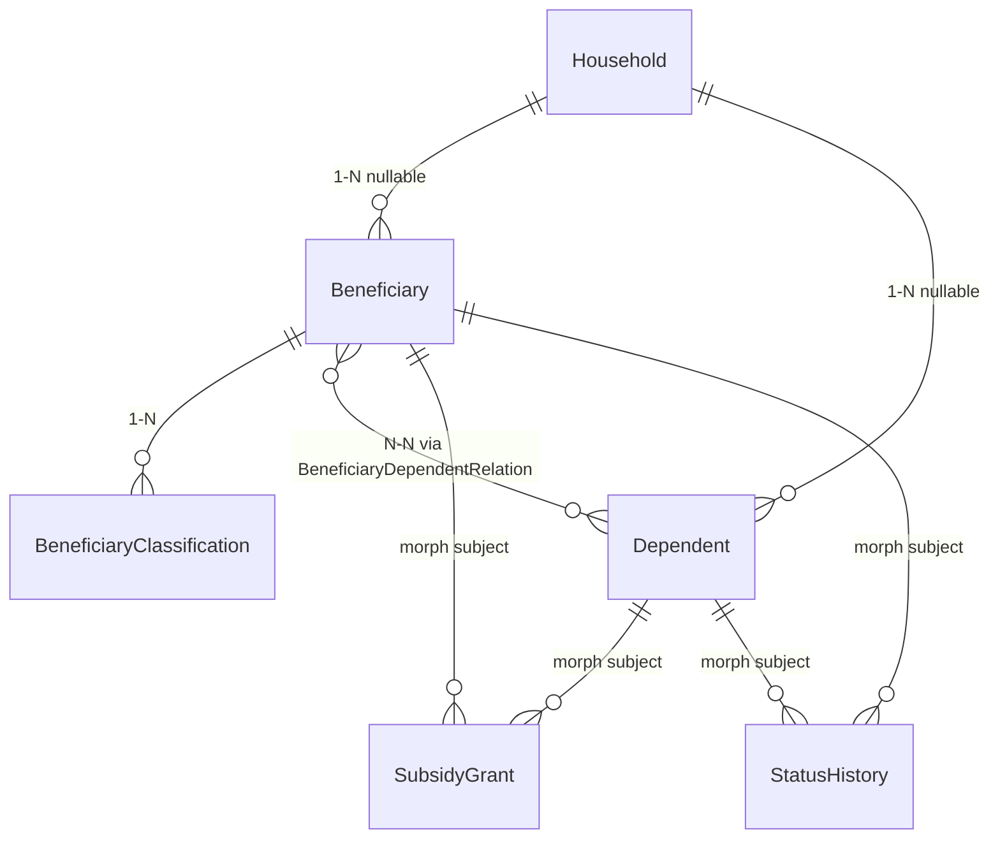

# Module: Beneficiary (Người có công theo Hộ gia đình & Thân nhân)

> Ngày tạo: 11:05:00 16/07/2026
> Cập nhật lần cuối: 15:00:00 21/07/2026 — bổ sung `GET .../import-template` cho cả 5 resource có import (mục 9)

---

## 1. Mục đích nghiệp vụ

Quản lý hồ sơ người có công (thương binh, liệt sĩ, người hoạt động kháng chiến...) theo hộ gia đình và thân nhân hưởng chế độ, cho cán bộ Lao động — Thương binh & Xã hội (LĐTBXH) cấp phường/xã tại TP Đà Nẵng. Module xử lý toàn bộ vòng đời: công nhận đối tượng, khai báo/liên kết thân nhân, cấp và dừng trợ cấp, theo dõi điều kiện hưởng biến động theo thời gian (tuổi, tình trạng sống), và nhắc lịch viếng thăm/tặng quà dịp lễ.

---

## 2. Vị trí trong codebase

```
app/Modules/Beneficiary/
  Controllers/
  Services/
  Models/
  Requests/
  Resources/
  Enums/
  Routes/
  Observers/            ← HouseholdObserver, BeneficiaryDependentRelationObserver
  Console/Commands/      ← Job hàng ngày check điều kiện hưởng, sinh lịch viếng thăm đầu năm
  Policies/
```

Route prefix: `/beneficiary` (hoặc theo prefix FE đã thống nhất, vd `/social-welfare` — cần chốt cùng FE trước khi generate route).
Namespace: `App\Modules\Beneficiary`

**Không có** `Events/`/`Listeners/`/`Notifications/` riêng trong module — Event nào cần **gửi thông báo** (Zalo/FCM) đăng ký vào hạ tầng dùng chung `app/Services/Notification/` (xem mục 7). Event thuần nội bộ (chỉ ghi `beneficiary_status_histories`, không gửi) có thể để trực tiếp trong Service, không cần thư mục `Events/` riêng cho một Listener duy nhất.

---

## 3. Entities & Models

| Model | Bảng | Mô tả | Multi-tenant |
|---|---|---|---|
| `ResidentialArea` | `beneficiary_residential_areas` | Tổ dân phố | ✓ |
| `Household` | `beneficiary_households` | Hộ gia đình | ✓ |
| `Beneficiary` | `beneficiaries` | Người có công | ✓ |
| `BeneficiaryClassification` | `beneficiary_classifications` | Phân loại đối tượng (1-N) | ✗ (theo qua `beneficiary_id`) |
| `Dependent` | `beneficiary_dependents` | Thân nhân | ✓ |
| `BeneficiaryDependentRelation` | `beneficiary_dependent_relations` | Pivot N-N Beneficiary–Dependent | ✗ (theo qua `beneficiary_id`) |
| `SubsidyPolicy` | `beneficiary_subsidy_policies` | Catalog mức trợ cấp | ✓ (nullable — catalog toàn TP) |
| `SubsidyGrant` | `beneficiary_subsidy_grants` | Lịch sử cấp trợ cấp (morph subject) | ✓ |
| `StatusHistory` | `beneficiary_status_histories` | Audit chuyển trạng thái (morph subject) | ✓ |
| `VisitSchedule` | `beneficiary_visit_schedules` | Lịch viếng thăm/tặng quà (morph subject, implement `Remindable`) | ✓ |

Chi tiết cột/index xem [`docs/database/Beneficiary.md`](../../database/Beneficiary.md).

### Quan hệ giữa entities



### Trường quan trọng cần chú ý

| Model | Trường | Ý nghĩa / Lưu ý |
|---|---|---|
| `Beneficiary` | `status` | `BeneficiaryStatusEnum` — active/deceased/moved_out/suspended, đổi qua `changeStatus()`, luôn ghi `beneficiary_status_histories` |
| `Household` | `member_count` | Denormalized, chỉ được ghi qua `HouseholdObserver`, không update tay ở Service |
| `BeneficiaryDependentRelation` | `eligible_until` | Tính trước bởi Job hàng ngày — không tính runtime mỗi lần đọc |
| `BeneficiaryClassification` | `is_primary` | Chỉ 1 bản ghi `true`/beneficiary — validate ở Service trước khi ghi, không ràng buộc DB |
| Mọi model có `organization_id` | `organization_id` | Tenant key, không nhận từ client (`store`/`import` gán từ context) |

---

## 4. Business Rules & Invariants

- Một cá nhân có thể **vừa là Beneficiary vừa là Dependent** của người khác (VD: vợ liệt sĩ đồng thời là thương binh) — không ràng buộc 1-1.
- Một `Dependent` có thể liên kết N-N với nhiều `Beneficiary` (VD: mẹ có 2 con là liệt sĩ) — mỗi liên kết là 1 bản ghi `beneficiary_dependent_relations` độc lập, điều kiện hưởng tính riêng từng bản ghi, **không gộp chung**.
- `beneficiary_dependent_relations.status = active` chỉ được tạo `SubsidyGrant` tương ứng khi quan hệ đã `active` (không cấp trợ cấp cho quan hệ chưa xác nhận).
- Không sửa trực tiếp `amount` trên `beneficiary_subsidy_grants` đã đóng — khi policy đổi mức, luôn đóng bản ghi cũ (`granted_to`) + tạo bản ghi mới nối tiếp (giữ lịch sử đầy đủ).
- `beneficiary_dependent_relations.eligible_until` chỉ tự động set bởi Job hàng ngày (mục 6.4) — cán bộ có thể can thiệp trước bằng cách set `eligibility_status = studying`/`disabled_no_work_capacity` kèm minh chứng để Job không tự expire.
- Household không xóa khi `moved_out` — chỉ đổi status, việc "chuyển hồ sơ sang phường khác" (đổi `organization_id`) là chức năng riêng cần quyền cấp quận, chưa nằm trong scope bản đầu.

---

## 5. State Machine

### `Beneficiary.status` (`BeneficiaryStatusEnum`)

| Trạng thái hiện tại | Sự kiện | Trạng thái mới | Điều kiện |
|---|---|---|---|
| `pending` | Xác nhận hồ sơ | `active` | Đủ giấy tờ bắt buộc (validate ở Service trước khi đổi) |
| `active` | Báo tử | `deceased` | Nhập `death_date`, `reason` |
| `active` | Chuyển đi | `moved_out` | Không xóa hồ sơ |
| `active` | Tạm dừng | `suspended` | |

### `BeneficiaryDependentRelation.status` (`DependentRelationStatusEnum`)

| Trạng thái hiện tại | Sự kiện | Trạng thái mới | Điều kiện |
|---|---|---|---|
| `active` | Job hàng ngày phát hiện đủ 18 tuổi + không `studying`/`disabled_no_work_capacity` | `expired` | Set `eligible_until` = ngày sinh nhật 18 tuổi |
| `active` | `Dependent.is_alive` chuyển `false` | `expired` | Trừ trường hợp truy lĩnh |

---

## 6. Luồng nghiệp vụ chính

### 6.1 Khởi tạo Hộ gia đình

```
1. Cán bộ tạo Household: household_code (tự sinh {org_code}-HGD-{seq} hoặc nhập tay),
   head_name, address, residential_area_id.
2. Service kiểm tra unique household_code theo organization_id.
3. Gán thành viên vào hộ (Beneficiary/Dependent) bằng cách update household_id trên record tương ứng.
4. HouseholdObserver tự cập nhật member_count mỗi khi thành viên được thêm/xóa khỏi hộ
   (Observer vì đây là data-integrity xảy ra ở MỌI nơi household_id bị đổi — API, Seeder, Console).
5. Không giới hạn số Beneficiary/hộ (VD: cả vợ và chồng đều là thương binh) — quan hệ household_id
   trên Beneficiary là N-1 thông thường.
```

### 6.2 Tiếp nhận & Công nhận Người có công mới

```
1. Cán bộ tạo Beneficiary mới, status = pending (hoặc active nếu đã có quyết định).
2. Với mỗi loại đối tượng được công nhận, thêm 1 bản ghi beneficiary_classifications
   (số quyết định, ngày quyết định, cơ quan ban hành). Một người có thể có nhiều bản ghi
   phân loại — chỉ 1 bản ghi is_primary = true dùng tính trợ cấp ưu tiên.
3. Đính kèm giấy tờ pháp lý qua MediaService::uploadOne() (collection decision_documents,
   identity_documents...) — KHÔNG gọi addMedia() trực tiếp trong Service.
4. Khi status: pending → active, BeneficiaryService::changeStatus() ghi beneficiary_status_histories
   trong cùng transaction, đây là ĐÚNG MỘT đường ghi qua Service → theo CLAUDE.md §EDA
   ("1 đường ghi duy nhất → Service"), có thể fire event trực tiếp trong Service, không cần Observer.
   Nếu bước này cần gửi Zalo OA cho cấp trên xác nhận → đăng ký BeneficiaryStatusChanged vào
   NotificationEventEnum (xem mục 7), KHÔNG gọi NotificationService trực tiếp.
5. Sau khi active, đề xuất gán hộ gia đình (nếu chưa có) và đề xuất thân nhân liên quan
   (tra theo địa chỉ/họ tên trùng, nếu đã tồn tại trong dữ liệu).
```

**Lối tắt nhập liệu nhanh cho hồ sơ hoàn toàn mới** (áp dụng nguyên tắc Aggregate — "đi liền
một khối thì lưu một khối"): `POST /beneficiaries` chấp nhận thêm 2 field tùy chọn, chỉ dùng ở
bước **tạo mới**, không có ở `update()`:

- `household` (object, loại trừ với `household_id`) — tạo hộ gia đình mới trong CÙNG transaction,
  tái dùng nguyên `HouseholdService::store()` (không tách bản sao logic sinh `household_code`).
- `dependents` (array) — mỗi phần tử = trường thân nhân (`StoreDependentRequest`) + thêm
  `relationship_type`/`eligible_from` để tự tạo luôn `beneficiary_dependent_relations`, tái dùng
  `DependentService::store()` + `DependentService::addRelation()` (giữ đúng quy tắc tính
  `status` active/expired theo tuổi ở Luồng 3 bước 3, không hard-code).

Sau khi tạo, hộ/thân nhân vẫn là resource độc lập — sửa tiếp qua `beneficiary-households`/
`beneficiary-dependents` như bình thường. Đây chỉ là rút gọn cho ĐÚNG lúc dữ liệu "đi liền một
khối" (tiếp nhận hồ sơ mới toanh); không lặp lại lối tắt này khi sửa hồ sơ đã tồn tại vì lúc đó
hộ/thân nhân đã có vòng đời riêng.

`PUT /beneficiaries/{id}` giờ đồng bộ được `classifications` (trước đây chỉ tạo được lúc `store`,
không sửa/xóa được sau khi tạo — đã vá): có `id` = cập nhật, không có `id` = tạo mới, dòng vắng
mặt trong payload **giữ nguyên**, xóa phải qua `classifications_deleted` tường minh (không suy ra
từ việc thiếu trong payload). Bất biến "chỉ 1 `is_primary=true`/hồ sơ" được `BeneficiaryService`
enforce trên TOÀN BỘ classification của beneficiary, kể cả dòng không nằm trong payload gửi lên.

### 6.3 Khai báo & Liên kết Thân nhân

```
1. Cán bộ tạo Dependent (có thể độc lập, chưa gắn Beneficiary nào).
2. Để thân nhân được hưởng chế độ, tạo bản ghi beneficiary_dependent_relations: chọn Beneficiary,
   relationship_type, eligible_from.
3. Service tự validate:
   - relationship_type = child và tuổi ≥ 18 → bắt buộc chọn eligibility_status
     (studying/disabled_no_work_capacity) mới cho phép status = active, ngược lại tự chuyển expired.
   - is_alive = false → tự khóa status = expired cho MỌI quan hệ pivot của người này
     (trừ trường hợp truy lĩnh).
4. Một Dependent có thể liên kết N-N với nhiều Beneficiary — mỗi liên kết 1 bản ghi pivot riêng,
   điều kiện hưởng độc lập (không gộp thành 1 record).
5. Khi quan hệ pivot active, hệ thống mới cho phép tạo beneficiary_subsidy_grants tương ứng (6.5).
```

### 6.4 Theo dõi điều kiện hưởng theo thời gian (tự động — Scheduled Job)

```
1. Console Command chạy hàng ngày (đăng ký routes/console.php, withoutOverlapping()),
   quét beneficiary_dependent_relations.status = active.
2. Với mỗi thân nhân là con liệt sĩ/thương binh:
   - Tính tuổi hiện tại từ beneficiary_dependents.date_of_birth.
   - Nếu tuổi ≥ 18 và eligibility_status != studying/disabled_no_work_capacity →
     update trực tiếp eligible_until = ngày sinh nhật 18 tuổi, status = expired.
3. QUAN TRỌNG — 2 đường ghi cho cùng 1 field: cán bộ cũng có thể đổi status pivot thủ công qua
   Service (VD: xác nhận thân nhân đã chết). Job ở bước 2 update TRỰC TIẾP qua Eloquent,
   KHÔNG đi qua Service. Theo cây quyết định CLAUDE.md §EDA ("Observer có được fire Event
   không?"): đây là tình huống 2 đường ghi cùng cần notify → PHẢI dùng Observer trên model
   BeneficiaryDependentRelation (lắng nghe updated khi status đổi sang expired), Observer fire
   event(new DependentEligibilityExpired($relation)). Job chỉ update() bình thường, KHÔNG tự
   gọi thông báo — nếu chỉ fire event trong Service thì nhánh Job sẽ không bao giờ báo cho
   cán bộ xác minh, sai với bước 4 dưới đây.
4. Listener của DependentEligibilityExpired (đăng ký theo hạ tầng Notification chung, xem mục 7):
   - Ghi beneficiary_status_histories.
   - Tự động chuyển các beneficiary_subsidy_grants đang active của thân nhân này sang terminated,
     termination_reason = "Hết điều kiện hưởng theo tuổi".
   - Gửi thông báo Zalo OA cho cán bộ phụ trách xác minh lại (có thể thân nhân đang học,
     cần bổ sung minh chứng).
5. Cán bộ có thể can thiệp thủ công TRƯỚC khi Job chạy — cập nhật eligibility_status = studying
   kèm minh chứng để Job không tự động expire.
```

### 6.5 Cấp & Dừng Trợ cấp

```
1. Khi Beneficiary/Dependent đủ điều kiện, cán bộ tạo SubsidyGrant: chọn beneficiary_subsidy_policy_id
   phù hợp, hệ thống tự điền amount từ policy (cho phép sửa nếu có điều chỉnh đặc biệt),
   nhập granted_from.
2. Trước khi tạo, Service kiểm tra beneficiary_subsidy_policies.effective_to — nếu policy hết
   hiệu lực, chặn và yêu cầu chọn policy mới.
3. Khi Nhà nước ban hành mức trợ cấp mới (VD: tăng mức từ 01/07 hàng năm):
   - Tạo bản ghi beneficiary_subsidy_policies mới với effective_from mới, đóng effective_to
     của policy cũ.
   - DB::transaction(): với mọi beneficiary_subsidy_grants.status = active thuộc policy cũ →
     đóng granted_to, tạo grant mới nối tiếp theo policy mới. Đây là ghi nhiều bước có phụ thuộc
     → bắt buộc bọc transaction theo CLAUDE.md §4.
4. Khi Beneficiary/Dependent chết, chuyển đi, hoặc thân nhân hết điều kiện → event tương ứng
   (đã fire ở đúng 1 đường ghi hoặc qua Observer theo mục 6.4) tự động set
   beneficiary_subsidy_grants.status = terminated + termination_reason.
5. Mọi thay đổi trạng thái trợ cấp fire event SubsidyGranted/SubsidyTerminated dùng
   ShouldDispatchAfterCommit (event ghi DB rồi có thể fire notification) — Service KHÔNG BAO GIỜ
   gọi trực tiếp NotificationService.
```

### 6.6 Thay đổi trạng thái sự sống/cư trú (chết, chuyển đi, tạm dừng)

```
1. Cán bộ cập nhật status của Beneficiary (VD: active → deceased) qua
   BeneficiaryService::changeStatus() — MỘT đường ghi duy nhất → fire event trực tiếp trong
   Service, không cần Observer (khác với 6.4).
2. Event BeneficiaryStatusChanged (ShouldDispatchAfterCommit) → Listener:
   - Ghi beneficiary_status_histories.
   - Rà soát toàn bộ beneficiary_dependent_relations liên quan → đánh giá lại điều kiện hưởng
     tuất (khi người có công chết, thân nhân có thể BẮT ĐẦU được hưởng tuất, khác lúc còn sống).
   - Dừng các beneficiary_subsidy_grants đang active gắn trực tiếp với Beneficiary này.
3. Trường hợp moved_out: không xóa hồ sơ, chỉ đổi status. Chuyển hồ sơ sang organization_id
   khác (nếu phường đích cũng dùng Danatec) là chức năng cần quyền cấp quận, ngoài scope bản đầu.
```

### 6.7 Quản lý Hồ sơ/Giấy tờ

```
1. Cán bộ upload giấy tờ mới qua giao diện, chọn document_type.
2. File qua MediaService::uploadOne()/uploadMany(), gắn đúng collection
   (decision_documents, identity_documents, death_certificates, medical_certificates)
   của Beneficiary hoặc Dependent.
3. Thiếu giấy tờ bắt buộc (VD: thiếu quyết định công nhận) là điều kiện chặn khi chuyển
   status → active — validate ở Service TRƯỚC khi fire event, không validate sau.
```

### 6.8 Nhắc lịch Viếng thăm & Tặng quà — dùng hạ tầng Reminder chung

```
1. Đầu mỗi năm/đầu mỗi dịp lễ (Tết, 27/7), Console Command của module tự sinh
   beneficiary_visit_schedules cho toàn bộ Beneficiary/Household đang active trong phường,
   với occasion tương ứng. Đây là data-integrity (chuẩn bị dữ liệu) → không cần fire Event.
2. Ngay sau khi tạo mỗi record, Command gọi ReminderScheduler::scheduleFor($visitSchedule)
   — VisitSchedule model implement Remindable (getReminderDeadline() = scheduled_date,
   getReminderModuleKey() = 'beneficiary'). KHÔNG viết Job/Notification riêng cho việc nhắc —
   ReminderScheduler tự tạo reminder PRESET dựa trên notification_event_configs mà cán bộ
   phường đã cấu hình qua UI admin có sẵn (route /event-configs, giống Meeting/Scheduling).
3. ProcessRemindersCommand (đã chạy sẵn cho toàn hệ thống) tự gửi khi đến remind_at, qua
   NotificationDispatcher + kênh Zalo OA đã cấu hình — không cần Job riêng của module.
4. Cán bộ được phân assigned_to xem danh sách lịch cần thực hiện, cập nhật status = done sau
   khi hoàn thành (đính kèm ảnh xác nhận qua MediaService, collection visit_evidence).
5. Cán bộ cũng có thể tạo lịch nhắc thủ công cho ngày sinh nhật, ngày giỗ liệt sĩ...
   occasion = custom — vẫn implement Remindable như trên, không có luồng riêng.
```

### 6.9 Báo cáo & Thống kê

```
1. Báo cáo tổng hợp theo phường: số lượng Beneficiary theo BeneficiaryTypeEnum, số thân nhân
   đang hưởng tuất, tổng kinh phí trợ cấp đang chi trả
   (SUM(beneficiary_subsidy_grants.amount) WHERE status = active).
2. Báo cáo biến động: số tăng mới/giảm (chết, hết điều kiện, chuyển đi) trong kỳ — truy vấn
   trực tiếp từ beneficiary_status_histories theo khoảng thời gian, không tính lại từ trạng
   thái hiện tại.
3. Xuất Excel (maatwebsite/excel), lọc theo residential_area_id, loại đối tượng, khoảng thời gian.
4. Luôn Eager Loading (with('classifications', 'household', 'activeSubsidyGrants')) để tránh
   N+1 khi danh sách lớn.
```

### 6.10 Phân quyền theo địa bàn

```
1. Cán bộ phường đăng nhập → mọi truy vấn tự động scope theo organization_id (TenantModel
   global scope), qua middleware set.permissions.team (header X-Organization-Id).
2. BeneficiaryPolicy/DependentPolicy kiểm tra thêm: cán bộ chỉ được sửa hồ sơ thuộc phường
   mình — không check permission thủ công trong Service.
3. Vai trò cấp quận xem nhiều phường là điểm cần mở rộng kiến trúc sau này
   (xem docs/database/Beneficiary.md mục 15.4), chưa nằm trong scope hiện tại.
```

---

## 7. Events & Side-effects

| Event | Khi nào fire | Nơi fire | Có gửi thông báo? | Đăng ký ở |
|---|---|---|---|---|
| `BeneficiaryStatusChanged` | `changeStatus()` trong `BeneficiaryService` — 1 đường ghi duy nhất | Trực tiếp trong Service | Có, nếu cần Zalo OA cho cấp trên xác nhận | `NotificationEventEnum` + `ContentBuilder` riêng, `module_key = beneficiary` |
| `DependentEligibilityExpired` | Job hàng ngày update trực tiếp `beneficiary_dependent_relations.status` — 2 đường ghi | **Observer** trên `BeneficiaryDependentRelation` (không fire trong Service, vì Job không đi qua Service) | Có — nhắc cán bộ xác minh | Như trên |
| `SubsidyGranted` / `SubsidyTerminated` | Mỗi lần `beneficiary_subsidy_grants.status` đổi | Trong Service (1 đường ghi qua `SubsidyGrantService`) | Tùy nghiệp vụ — nếu bản đầu chỉ cần ghi `beneficiary_status_histories` mà chưa cần gửi Zalo, GIỮ Event nội bộ trong module, KHÔNG đăng ký vào `NotificationEventEnum` cho tới khi có yêu cầu gửi thật (Simplicity First) | Nội bộ module hoặc Notification chung — chốt cùng nghiệp vụ trước khi code |
| `BeneficiaryVisitReminder` | Đến `remind_at` do `ReminderScheduler` tính | `ProcessRemindersCommand` (hạ tầng chung, không phải code riêng của module) | Có | `NotificationEventEnum` + `BeneficiaryVisitReminderContentBuilder` |

**Bắt buộc:** mọi Event ở trên ghi DB rồi fire notification phải dùng `ShouldDispatchAfterCommit` (tránh race condition khi transaction chưa commit).

**Quy tắc chọn nơi fire (nhắc lại từ CLAUDE.md §EDA):** không chọn theo "có phải Service hay không", mà chọn theo "có bao nhiêu đường ghi vào model". 1 đường ghi duy nhất → Service. Nhiều đường ghi đều phải notify → Observer.

---

## 8. Permissions

| Permission key | Mô tả |
|---|---|
| `beneficiaries.index` / `.show` / `.store` / `.update` / `.destroy` | CRUD hồ sơ người có công |
| `beneficiaries.bulkDestroy` / `.bulkUpdateStatus` / `.changeStatus` | Thao tác hàng loạt/đổi trạng thái |
| `beneficiaries.export` / `.import` / `.stats` | Xuất/nhập/thống kê |
| `beneficiary-households.*` | CRUD hộ gia đình (bộ action tương tự) |
| `beneficiary-residential-areas.*` | CRUD danh mục tổ dân phố (bộ action tương tự, không có status) |
| `beneficiary-dependents.*` | CRUD thân nhân |
| `beneficiary-subsidy-grants.index` / `.store` / `.changeStatus` | Cấp/dừng trợ cấp — **không cần** `bulkDestroy`/`import` nếu grant chỉ tạo qua luồng nghiệp vụ (6.5), không phải free-form CRUD (chốt cùng nghiệp vụ) |
| `beneficiary-visit-schedules.index` / `.changeStatus` | Xem & cập nhật lịch viếng thăm |

> Cập nhật `PERMISSIONS` trong `database/seeders/PermissionSeeder.php`, resource key trùng prefix API route.

---

## 9. API Endpoints

Đã triển khai (xem `app/Modules/Beneficiary/Routes/*.php`, kế hoạch chi tiết ở `docs/answer/module-nguoi-co-cong-phan-tich-giai-phap_105303_16072026.md` mục 5). Tóm tắt:

- `beneficiaries` — đầy đủ bộ chuẩn CLAUDE.md §3 (`stats,index,show,store,update,destroy,bulkDestroy,bulkUpdateStatus,changeStatus,export,import`) + nested `GET /{id}/status-histories`. `POST /beneficiaries` nhận thêm `household`/`dependents` tùy chọn (lối tắt tạo kèm hộ + thân nhân cho hồ sơ mới, xem mục 6.2); `PUT /beneficiaries/{id}` sync được `classifications`/`classifications_deleted`.
- `beneficiary-households`, `beneficiary-residential-areas`, `beneficiary-dependents`, `beneficiary-subsidy-policies` — **không có** `bulkUpdateStatus`/`changeStatus` vì không có cột `status` (khác giả định ban đầu ở mục này) — xem lý do cập nhật ở `docs/answer/...` mục 5.
- `beneficiary-dependents` có thêm `POST /{id}/relations`, `DELETE /{id}/relations/{relation}`.
- `beneficiary-subsidy-policies` có thêm `POST /{id}/renew`.
- `beneficiary-subsidy-grants` chỉ `index, store, changeStatus`; `beneficiary-visit-schedules` chỉ `index, show, changeStatus` — không CRUD tự do (lý do: bản ghi phát sinh từ hành động nghiệp vụ, không phải danh mục).
- Cả 5 resource có `import` (`beneficiaries`, `beneficiary-households`, `beneficiary-residential-areas`, `beneficiary-dependents`, `beneficiary-subsidy-policies`) đều có thêm `GET .../import-template` (dùng chung permission `.import`, theo quy ước CLAUDE.md §6 — trước 21/07/2026 bị thiếu, đã bổ sung đủ theo đúng pattern `ImportTemplateExport` dùng ở Core/Meeting/TaskAssignment).

---

## 10. Phụ thuộc module khác

| Phụ thuộc | Dùng gì | Ghi chú |
|---|---|---|
| `Core` | `MediaService` (upload giấy tờ, ảnh viếng thăm), `Organization` (tenant), `PermissionSeeder` | Không gọi `addMedia()`/`Storage::put` trực tiếp |
| `Notification engine` (`app/Services/Notification/`) | `NotificationDispatcher`, `ReminderScheduler`, `Remindable` contract, `NotificationEventConfig` | Fire event / implement `Remindable` → engine lo phần cấu hình + gửi. Không viết Job/Notification riêng cho module này |

---

## 11. Điểm dễ gây lỗi khi maintain

- **Job hàng ngày (6.4) update trực tiếp Eloquent, không qua Service** — nếu sau này thêm side-effect mới cho `DependentEligibilityExpired`, phải sửa ở Observer, KHÔNG sửa ở Service (Service không nằm trên đường ghi này).
- **`beneficiary_subsidy_policies.organization_id` nullable** — quên lọc đúng có thể lẫn catalog toàn TP với catalog riêng phường; luôn dùng `where('organization_id', null)->orWhere('organization_id', $tenantId)` khi query danh mục áp dụng.
- **`beneficiary_dependent_relations.eligible_until`** chỉ được Job set — nếu Service nào đó set tay giá trị này ngoài luồng 6.3/6.4, Job hàng ngày có thể ghi đè sai vì logic Job giả định chỉ chính nó ghi cột này.
- **`beneficiary_visit_schedules` không có cột `remind_at`/`channels`** — cột đó nằm ở bảng `reminders` (polymorphic) thông qua quan hệ `Remindable::reminders()`, không tìm trong bảng này.

---

## 12. Câu hỏi thường gặp

**Q:** Tại sao `beneficiary_visit_schedules` không có Job/Notification riêng như bản thiết kế nháp ban đầu?
**A:** Vì hạ tầng `reminders`/`ReminderScheduler`/`NotificationDispatcher` đã tồn tại và đang chạy cho Meeting/Scheduling/TaskAssignment — build riêng sẽ trùng lặp logic PRESET/CUSTOM, và cán bộ phường mất khả năng tự cấu hình "nhắc trước N ngày" qua UI admin đã có sẵn. Chỉ cần model implement `Remindable`.

**Q:** Tại sao `DependentEligibilityExpired` dùng Observer thay vì fire Event ngay trong Job?
**A:** Vì có 2 đường ghi độc lập vào `beneficiary_dependent_relations.status` (Service khi cán bộ đổi tay, Job khi hệ thống tự expire). Nếu chỉ fire trong Service, nhánh Job sẽ không bao giờ báo cho cán bộ — Observer đảm bảo Event fire dù đi qua đường nào.

**Q:** Vì sao `beneficiary_subsidy_policies`/`beneficiary_subsidy_grants` không tách thành module/engine dùng chung ngay từ đầu dù về bản chất không đặc thù riêng người có công?
**A:** Chưa có module thứ 2 xác nhận cần dùng — theo Simplicity First, không xây trừu tượng đầu cơ. Quyết định này cần ghi ADR để không bị quên khi module Hộ nghèo/Bảo trợ xã hội xuất hiện.
