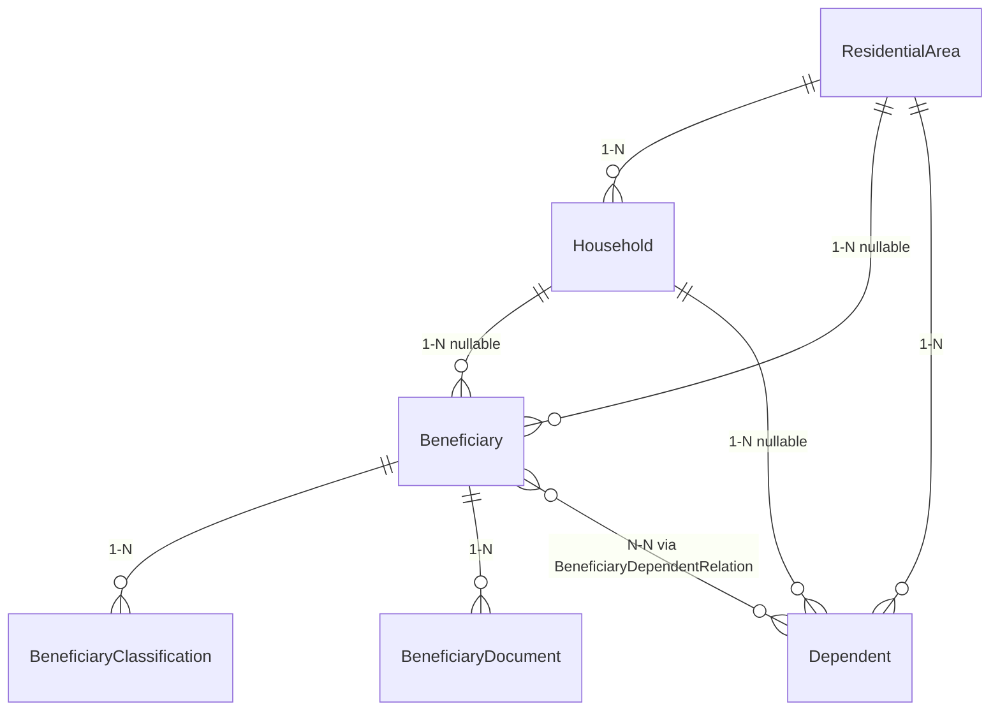

# Module: Beneficiary (Người có công theo Hộ gia đình & Thân nhân)

> Ngày tạo: 11:05:00 16/07/2026
> Cập nhật lần cuối: 07:40:00 26/07/2026 — (1) tổ dân phố / thôn thành trường riêng của người có công (`beneficiaries.residential_area_id`); (2) chuẩn hóa payload `store`/`update`: hộ + tổ dân phố là ID, thân nhân là mảng liên kết `dependent_id`, thêm mảng `documents`, cả 3 mảng con đồng bộ coarse.

---

## 1. Mục đích nghiệp vụ

Quản lý hồ sơ **cơ bản** người có công (thương binh, liệt sĩ, người hoạt động kháng chiến…) theo hộ gia đình và thân nhân, cho cán bộ LĐTBXH cấp phường/xã tại TP Đà Nẵng: khai báo hộ/tổ dân phố, tiếp nhận người có công, phân loại đối tượng (kèm file quyết định), khai báo & liên kết thân nhân, và quản lý danh sách giấy tờ hồ sơ đính kèm.

Module **không** xử lý tính/chi trả trợ cấp, không theo dõi điều kiện hưởng theo thời gian, không nhắc lịch viếng thăm — các phần đó đã được lược bỏ để giữ hồ sơ ở mức cơ bản.

---

## 2. Vị trí trong codebase

```
app/Modules/Beneficiary/
  Controllers/  Services/  Models/  Requests/  Resources/  Enums/  Routes/
  Observers/            ← chỉ HouseholdObserver (giữ member_count)
```

Namespace: `App\Modules\Beneficiary`. **Không có** `Events/`/`Listeners/`/`Jobs/`/`Notifications/`/`Console/` — module là CRUD thuần + đính kèm media.

---

## 3. Entities & Models

| Model | Bảng | Multi-tenant | Ghi chú |
|---|---|---|---|
| `ResidentialArea` | `beneficiary_residential_areas` | ✓ | Tổ dân phố / thôn |
| `Household` | `beneficiary_households` | ✓ | `member_count` denormalized (HouseholdObserver) |
| `Beneficiary` | `beneficiaries` | ✓ | có `status` (không audit), `residential_area_id` (tổ dân phố riêng, độc lập với hộ) |
| `BeneficiaryClassification` | `beneficiary_classifications` | ✗ (qua `beneficiary_id`) | HasMedia — `decision_documents` |
| `Dependent` | `beneficiary_dependents` | ✓ | có `residential_area_id`, `phone`, tọa độ |
| `BeneficiaryDependentRelation` | `beneficiary_dependent_relations` | ✗ | pivot chỉ `relationship_type` + `note` |
| `BeneficiaryDocument` | `beneficiary_documents` | ✓ | HasMedia — `files` (Tên giấy tờ + nhiều file) |

Chi tiết cột/index: [`docs/database/Beneficiary.md`](../../database/Beneficiary.md).
Chi tiết endpoint: [`docs/api/beneficiary.md`](../../api/beneficiary.md).
Hướng dẫn tích hợp FE: [`docs/answer/nguoi-co-cong-huong-dan-frontend_095245_26072026.md`](../../answer/nguoi-co-cong-huong-dan-frontend_095245_26072026.md).



---

## 4. Business Rules & Invariants

- Một cá nhân có thể **vừa là Beneficiary vừa là Dependent** của người khác — không ràng buộc 1-1.
- Một `Dependent` liên kết N-N với nhiều `Beneficiary`, mỗi liên kết 1 bản ghi pivot độc lập.
- Classification: chỉ 1 bản ghi `is_primary = true`/beneficiary — enforce ở `BeneficiaryService` (kể cả dòng cũ không nằm trong payload).
- `Beneficiary.status` đổi qua `changeStatus()`/`bulkUpdateStatus()` — **không ghi lịch sử** (đã bỏ bảng audit).
- Media (file quyết định, giấy tờ) luôn qua `Core\Services\MediaService`, không gọi `addMedia()`/`Storage` trực tiếp.
- `member_count` chỉ ghi qua `HouseholdObserver` (áp mọi đường đổi `household_id`).
- **Tổ dân phố là trường riêng của từng bảng** (`beneficiaries`, `beneficiary_households`, `beneficiary_dependents`) — gán/đổi hộ **không** tự đồng bộ `residential_area_id` sang người có công. Thống kê `by_residential_area` đọc thẳng `beneficiaries.residential_area_id`.

---

## 5. Luồng nghiệp vụ chính

1. **Tổ dân phố / Hộ**: tạo `ResidentialArea` → tạo `Household` (chỉ `head_name` bắt buộc; địa chỉ bổ sung sau). Gán thành viên bằng cách set `household_id` trên Beneficiary/Dependent → Observer cập nhật `member_count`.
2. **Tiếp nhận người có công**: `POST /beneficiaries` (status mặc định `pending`). Hộ và tổ dân phố là **ID** (`household_id`, `residential_area_id` — tạo trước qua resource của nó). Kèm 3 mảng con: `classifications[]` (chỉ bắt buộc `type`), `dependents[]` (**liên kết** thân nhân có sẵn: `dependent_id` + `relationship_type`), `documents[]` (`name` + `note`; tập tin upload riêng qua `beneficiary-documents`). `PUT` xử lý cả 3 mảng theo **full replace**: gửi mảng nào thì xóa sạch danh sách cũ rồi tạo lại theo mảng đó, không gửi khóa thì giữ nguyên, gửi `[]` là xóa sạch. Không nhận `id` trong phần tử → `PUT` idempotent, không cần `*_deleted`. Đổi lại, thay danh sách `documents`/`classifications` sẽ **xóa file đính kèm** của dòng cũ.
3. **File quyết định công nhận**: sau khi có classification, upload file qua `POST /beneficiaries/{b}/classifications/{c}/files` (collection `decision_documents`), xóa qua `DELETE .../files/{media}`.
4. **Thân nhân & quan hệ**: tạo `Dependent` (gắn tổ dân phố, SĐT, tọa độ tùy chọn) → liên kết theo 1 trong 2 chiều: `POST /beneficiary-dependents/{id}/relations` (chọn `beneficiary_id`) hoặc mảng `dependents[]` trong payload người có công (chọn `dependent_id`). Cùng ghi vào `beneficiary_dependent_relations`.
5. **Đổi trạng thái**: `PATCH /beneficiaries/{id}/status` (deceased kèm `death_date`).
6. **Giấy tờ hồ sơ**: `beneficiary-documents` — mỗi bản ghi 1 *Tên giấy tờ* + nhiều file (collection `files`).

---

## 6. Permissions

| Permission key | Mô tả |
|---|---|
| `beneficiaries.*` (`stats,index,show,store,update,destroy,bulkDestroy,bulkUpdateStatus,changeStatus,export,import`) | Hồ sơ người có công (file quyết định classification dùng chung `beneficiaries.update`) |
| `beneficiary-households.*` | Hộ gia đình (không có changeStatus/bulkUpdateStatus) |
| `beneficiary-residential-areas.*` | Tổ dân phố (không có changeStatus/bulkUpdateStatus) |
| `beneficiary-dependents.*` (+ `storeRelation`, `destroyRelation`) | Thân nhân & quan hệ |
| `beneficiary-documents.*` (`index,show,store,update,destroy,bulkDestroy`) | Giấy tờ hồ sơ |

Cập nhật `PERMISSIONS` trong `database/seeders/PermissionSeeder.php` (đã bỏ block subsidy-policies/subsidy-grants/visit-schedules).

> **Mảng lồng không được vượt quyền**: `store`/`update` hồ sơ nhận kèm `documents[]`/`dependents[]`,
> nhưng hai bảng này có permission riêng nên `StoreBeneficiaryRequest`/`UpdateBeneficiaryRequest`
> soát thêm ở `authorize()` (trait `Concerns\AuthorizesBeneficiarySections`): tạo/sửa/xóa tài liệu
> cần `beneficiary-documents.store/update/destroy`, quan hệ thân nhân cần
> `beneficiary-dependents.storeRelation/destroyRelation`. Thiếu quyền → 403 toàn request.
> `classifications` không cần — không có resource riêng.

---

## 7. API Endpoints (tóm tắt)

- `beneficiaries` — bộ chuẩn đầy đủ + `POST /{id}/classifications/{classification}/files`, `DELETE /{id}/classifications/{classification}/files/{media}`. `POST` nhận thêm `household`/`dependents` tùy chọn; `PUT` sync `classifications`/`classifications_deleted`.
- `beneficiary-households`, `beneficiary-residential-areas`, `beneficiary-dependents` — CRUD + export/import + import-template (không changeStatus/bulkUpdateStatus). **Export liệt kê các quan hệ xung quanh**: 1-1 xuất theo tên (CCCD chủ hộ, Tổ dân phố), 1-N/N-N liệt kê ngăn cách `; ` (Thân nhân, Loại đối tượng, Giấy tờ, Người có công liên kết…) — cột liệt kê chỉ tham chiếu, import bỏ qua. Import liên kết danh mục 1-1 bằng **tên**, ràng buộc tối thiểu (chỉ tên/giới tính/chủ hộ bắt buộc).
- `beneficiary-dependents` có thêm `POST /{id}/relations`, `DELETE /{id}/relations/{relation}`.
- `beneficiary-documents` — `index, show, store, update, destroy, bulk-delete` (không export/import).
- `beneficiary-enums` — tra cứu enum.
- `beneficiary-statistics` (dashboard, read-only, permission `beneficiary-statistics.view`): `overview` (gộp tất cả), `by-type`, `by-status`, `by-residential-area`, `households-by-area`, `by-gender`, `by-age-group`, `by-relationship`, `new-by-month` (param `year`). Mỗi breakdown trả mảng `{key,label,total}` để FE dựng bar/pie/line; `overview` trả kèm `summary` (KPI cards). Xem `StatisticsService`.

> **Đã bỏ**: `beneficiary-subsidy-policies`, `beneficiary-subsidy-grants`, `beneficiary-visit-schedules`, `beneficiary/notification-config`, nested `GET /beneficiaries/{id}/status-histories`, `GET /beneficiary-dependents/{id}/status-histories`.

Sau thay đổi API: `sail artisan scribe:generate`.

---

## 8. Phụ thuộc module khác

| Phụ thuộc | Dùng gì |
|---|---|
| `Core` | `MediaService` (upload/xóa file), `Organization` (tenant), `PermissionSeeder`, `TenantModel`, `VietnameseSort`, `ImportTemplateExport` |

Module **không còn** phụ thuộc `app/Services/Notification/` (đã gỡ toàn bộ đăng ký module/event/content-builder/route notification-config).

---

## 9. Điểm cần lưu ý khi maintain

- **Media models phải nằm trong `morphMap`** (`AppServiceProvider`) vì map bị enforce: `beneficiary_classification`, `beneficiary_document` (cùng `beneficiary`, `beneficiary_dependent`, `beneficiary_household`). Thêm model HasMedia mới → nhớ thêm alias, nếu không sẽ lỗi "No morph map defined".
- **File đính kèm không đi trong JSON**: classification decision files & document files upload qua endpoint multipart riêng, không nhét vào body JSON của store/update beneficiary.
- **`status` không còn audit**: nếu nghiệp vụ cần truy vết đổi trạng thái sau này, phải khôi phục bảng lịch sử.
- **Import tra hộ theo `head_id_number` (CCCD chủ hộ)** thay cho `household_code` (đã bỏ); tra tổ dân phố theo `name`.
