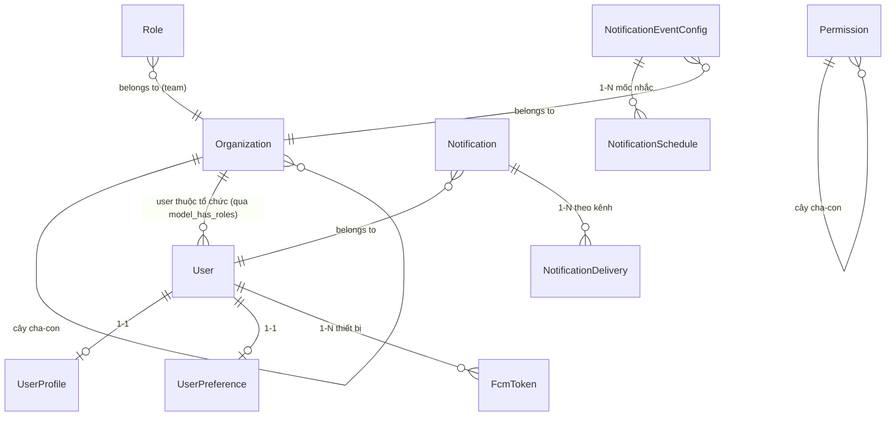

# Module: Core (Nền tảng dùng chung)

> Ngày tạo: 11:25:35 19/07/2026
> Cập nhật lần cuối: 11:25:35 19/07/2026

---

## 1. Mục đích nghiệp vụ

Module nền tảng (không phải domain nghiệp vụ riêng) cung cấp hạ tầng dùng chung cho toàn bộ hệ thống: quản lý người dùng và hồ sơ cá nhân, tổ chức (tenant) đa cấp, phân quyền (Role/Permission theo Spatie), cấu hình hệ thống (Setting), nhật ký hoạt động (LogActivity), quản lý media/upload, và lớp quản trị thông báo (Notification — cấu hình, log, template, "hộp thư" cá nhân). Mọi module nghiệp vụ khác (Meeting, Scheduling, TaskAssignment, Beneficiary...) đều phụ thuộc vào Core cho các nhu cầu này thay vì tự cài lại.

**Lưu ý phạm vi:** Core KHÔNG chứa engine gửi thông báo thực tế (Zalo/FCM/Email/SMS dispatch, template rendering theo event, reminder scheduling) — phần đó nằm ở hạ tầng riêng `app/Services/Notification/` (ngoài `app/Modules/`), Core chỉ cung cấp các model dữ liệu (`Notification`, `NotificationDelivery`, `NotificationEventConfig`, `NotificationSchedule`, `NotificationTemplate`) và API quản trị/xem cho phần đó.

---

## 2. Vị trí trong codebase

```
app/Modules/Core/
  *.php           ← Controller đặt TRỰC TIẾP ở root module (không có thư mục Controllers/),
                     khác quy ước các module nghiệp vụ khác — xem mục 11
  Services/       ← LogActivity, Media, Organization, Permission, Role, Setting,
                     UserPreference, UserProfile, User
  Models/         ← 15 model (xem mục 3)
  Requests/
  Resources/      ← + Concerns/
  Enums/          ← StatusEnum, UserStatusEnum, SettingGroupEnum
  Routes/         ← 1 file / resource (log_activity, notification, organization,
                     permission, role, setting, user)
  Observers/      ← UserObserver (auto-tạo UserProfile rỗng khi user mới)
  Traits/         ← RespondsWithJson, HasOrganizationScope, TranslatesExcelHeadings
  Middleware/
  Support/
  Exports/ Imports/
```

Namespace: `App\Modules\Core`. Không có prefix route chung cho toàn module — mỗi resource có route riêng (`/users`, `/organizations`, `/roles`, `/permissions`, `/settings`, `/log-activities`, `/notifications`).

Hạ tầng liên quan nhưng KHÔNG nằm trong module này: `app/Services/Notification/` (Channels, ContentBuilders, Events, Jobs, Listeners, Services — bao gồm `ReminderScheduler`, `NotificationDispatcher`).

---

## 3. Entities & Models

| Model | Bảng | Mô tả | Multi-tenant |
|---|---|---|---|
| `Organization` | `organizations` | Tổ chức (tenant), cấu trúc cây qua `parent_id` | — (chính là đơn vị tenant) |
| `User` | `users` | Người dùng hệ thống — `HasRoles`/`HasPermissions` (Spatie, guard `web`) | Thuộc ≥1 organization qua model_has_roles |
| `UserProfile` | `user_profiles` | Hồ sơ mở rộng của user (tự tạo rỗng qua `UserObserver`) | ✗ |
| `UserPreference` | `user_preferences` | Tùy chọn cá nhân, gồm `current_organization_id` (tenant đang chọn) | ✗ |
| `Role` | `roles` | Vai trò (extends Spatie `Role`), gắn `organization_id` (team) | ✓ |
| `Permission` | `permissions` | Quyền hạn (extends Spatie `Permission`), phân cấp cha-con | ✗ (dùng chung toàn hệ thống) |
| `Setting` | `settings` | Cấu hình hệ thống theo nhóm (`SettingGroupEnum`), có thể kèm media | ✗ (áp dụng toàn hệ thống, cache qua `clearCache()`) |
| `LogActivity` | — | Nhật ký hoạt động người dùng | ✓ |
| `Notification` | — | Bản ghi thông báo đã gửi/sẽ gửi cho user, `notifiable` là morphTo | ✓ |
| `NotificationDelivery` | — | Chi tiết kết quả gửi theo từng kênh (Zalo/FCM/Email/SMS) của 1 Notification | — (theo qua Notification) |
| `NotificationEventConfig` | — | Cấu hình bật/tắt + kênh gửi cho từng `event_key` theo tổ chức | ✓ |
| `NotificationSchedule` | — | Mốc nhắc cấu hình cho 1 event (vd nhắc trước 30 phút, 1 ngày) | — (theo qua EventConfig) |
| `NotificationTemplate` | — | Template nội dung thông báo theo event | ✓ (nullable — có thể mặc định toàn hệ thống) |
| `FcmToken` | — | Token thiết bị nhận push notification của user | — (theo qua user) |
| `ZaloOaFollower` | — | Người theo dõi Zalo OA đã liên kết với user | — |

Chi tiết cột/index xem [`docs/database/Core.md`](../../database/Core.md).

### Quan hệ giữa entities



### Trường quan trọng cần chú ý

| Model | Trường | Ý nghĩa / Lưu ý |
|---|---|---|
| `User` | `status` | `UserStatusEnum` — active/inactive/**banned** (nhiều hơn `StatusEnum` chuẩn 2 giá trị) |
| `Role` | `organization_id` | Team ID theo cơ chế team-permission của Spatie — quyết định role chỉ áp dụng trong 1 tổ chức |
| `Permission` | `parent_id` | Cây phân cấp, dùng cho UI hiển thị nhóm quyền (endpoint `tree`) |
| `UserPreference` | `current_organization_id` | Tổ chức user đang chọn (đa tổ chức) — set khi `switchOrganization` (module Auth) |
| `Setting` | `group` | `SettingGroupEnum` — general/admin_page/org_select_page/social/api/notification/email/sms/zalo/chat/log/sso_danang/sso_cbccvc/auth |
| `Organization` | `parent_id` | Cây tổ chức — `getDepthAttribute()` tính độ sâu runtime |

---

## 4. Business Rules & Invariants

- `User` không tự thuộc "tổ chức hiện tại" — mỗi lần xác định tenant context, hệ thống đọc `UserPreference.current_organization_id` hoặc header `X-Organization-Id`, KHÔNG có cột `organization_id` cố định trên `User`.
- `UserProfile` luôn được tạo tự động (rỗng) ngay khi `User` được tạo, qua `UserObserver::created()` (dùng `firstOrCreate` — idempotent, an toàn nếu code khác đã tạo trước).
- `Permission` KHÔNG scope theo tổ chức (dùng chung định nghĩa toàn hệ thống) trong khi `Role` LUÔN gắn với 1 `organization_id` cụ thể — 1 role chỉ có hiệu lực trong đúng tổ chức đó (cơ chế team của Spatie Permission).
- `Setting` là cấu hình toàn hệ thống, có cơ chế cache (`Setting::clearCache()`) — mọi thay đổi qua `SettingService::update()` phải invalidate cache, không update thẳng DB rồi bỏ qua cache.
- Mọi model nghiệp vụ ở module khác thuộc tenant phải extends `TenantModel` (base class định nghĩa trong Core) — không tự cài `HasOrganizationScope` riêng lẻ từng model.
- Upload/xóa media của MỌI module đi qua `Core\Services\MediaService` (`uploadOne`, `uploadMany`, `removeByIds`, `cleanupStoredFiles` cho rollback khi lỗi transaction) — không gọi `addMedia()`/`Storage::put/delete` trực tiếp ở module khác.

---

## 5. State Machine

### `User.status` (`UserStatusEnum`)

| Trạng thái hiện tại | Sự kiện | Trạng thái mới | Điều kiện |
|---|---|---|---|
| `active` | Khóa tài khoản | `inactive` | Không cho đăng nhập, tài khoản có thể mở lại |
| `active`/`inactive` | Cấm vĩnh viễn | `banned` | Mức nghiêm trọng hơn `inactive`, dùng khi vi phạm |

### `Organization.status` / `Role`/`Permission` (StatusEnum chuẩn)

| Trạng thái hiện tại | Sự kiện | Trạng thái mới |
|---|---|---|
| `active` | `changeStatus()` | `inactive` |
| `inactive` | `changeStatus()` | `active` |

---

## 6. Luồng nghiệp vụ chính

### 6.1 Quản lý User & Hồ sơ

```
1. Admin tạo User (UserController::store) — thuộc ≥1 organization qua gán Role (Spatie
   model_has_roles với team_id = organization_id).
2. UserObserver::created() tự tạo UserProfile rỗng (firstOrCreate) ngay sau khi User tồn tại
   trong DB — data-integrity áp dụng ở MỌI nơi User được tạo (API, Seeder, Console, Tinker).
3. User tự cập nhật hồ sơ cá nhân qua GET/PUT /users/me, /users/me/profile — tách biệt route
   "me" (không cần permission, chỉ cần đăng nhập) và route admin quản lý user khác (permission
   users.*).
```

### 6.2 Phân quyền theo tổ chức (Team-based Permission)

```
1. Admin tạo Role gắn với 1 Organization cụ thể (Role.organization_id = team).
2. Gán Permission cho Role (permissions.tree hiển thị cây phân cấp cho UI chọn nhanh).
3. Gán Role cho User trong đúng organization đó — Spatie ghi vào model_has_roles kèm team_id.
4. Khi user gọi API kèm header X-Organization-Id, middleware set.permissions.team set
   permissions team context hiện tại → mọi check permission() chỉ tính role/permission thuộc
   đúng tổ chức đang chọn.
```

### 6.3 Cấu hình hệ thống (Setting)

```
1. Admin xem/sửa Setting theo key (SettingController::show/update), phân nhóm theo
   SettingGroupEnum để UI hiển thị tab (general, email, zalo, sso...).
2. Một số Setting kèm media (logo, favicon...) — qua MediaService, không tự addMedia().
3. Setting::clearCache() được gọi mỗi khi update — các Service khác đọc Setting qua
   SettingService (có cache), không query trực tiếp Model để tránh đọc giá trị cũ.
```

### 6.4 Nhật ký hoạt động (LogActivity)

```
1. Middleware LogActivity (app/Modules/Core/Middleware/LogActivity.php) tự động ghi
   log_activities cho các request thuộc resource/action đã khai báo trong resourceLabel()/
   actionLabels/pathActions — KHÔNG cần Service nghiệp vụ tự gọi ghi log thủ công.
2. Khi thêm resource/action mới ở BẤT KỲ module nào, phải cập nhật 3 mapping này trong
   LogActivity middleware (theo CLAUDE.md §8), nếu không hành động mới sẽ không được log.
3. Admin xem log qua LogActivityController: theo tổ chức, theo user, thống kê dashboard/
   timeline/top-users/top-organizations, xóa theo khoảng ngày (destroyByDate) hoặc xóa hết
   (destroyAll) — 2 action nguy hiểm, có permission riêng.
```

### 6.5 Quản trị Thông báo (lớp quản trị, không phải engine gửi)

```
1. NotificationConfigController: liệt kê modules đã đăng ký (modules()), xem/cập nhật
   NotificationEventConfig theo event_key (bật/tắt, chọn kênh), quản lý NotificationSchedule
   (các mốc nhắc trước hạn cho event đó) — đây chính là API đứng sau route
   {module}/event-configs mà Meeting/Scheduling/TaskAssignment/Beneficiary đều dùng chung.
2. NotificationTemplateController: CRUD template nội dung theo event, xem biến khả dụng
   (variables()) để admin soạn nội dung.
3. NotificationLogController: xem/lọc/xuất/xóa lịch sử Notification đã tạo (audit, debug
   gửi thất bại) — không phải nơi gửi, chỉ xem lại.
4. MyNotificationController: "hộp thư" cá nhân — user xem thông báo của mình, đếm chưa đọc,
   đánh dấu đã đọc, xóa — độc lập với phần cấu hình admin ở trên.
5. NotificationController::test(): gửi thử 1 thông báo (kiểm tra kênh đã cấu hình đúng chưa)
   qua NotificationService — chỉ dùng cho mục đích test, không phải luồng gửi thật.
```

### 6.6 Quản lý Tổ chức (Tenant, cấu trúc cây)

```
1. Admin cấp cao nhất tạo Organization gốc, các Organization con qua parent_id (tree()
   trả toàn bộ cây cho UI).
2. Đổi status (active/inactive) ảnh hưởng tất cả user/resource thuộc tổ chức đó — cần cẩn
   trọng, có permission changeStatus riêng.
3. Import/Export Organization theo bộ chuẩn CLAUDE.md §6.
```

---

## 7. Events & Side-effects

Module Core hiện chỉ có 1 Observer, không có `Events/`/`Listeners/`/`Jobs/` riêng:

| Cơ chế | Khi nào chạy | Side-effect |
|---|---|---|
| `UserObserver::created()` | Mọi nơi `User` được tạo (API, Seeder, Console, Tinker) | Tự tạo `UserProfile` rỗng — thuần data-integrity, không gửi thông báo |
| `LogActivity` (Middleware, không phải Observer/Event) | Mọi request khớp resource/action đã khai báo | Ghi `log_activities` |

Phần "gửi thông báo thật" (Zalo/FCM/Email/SMS) không thuộc Core — nằm ở `app/Services/Notification/Events|Listeners|Jobs`, các module nghiệp vụ (Meeting, Scheduling, TaskAssignment, Beneficiary) tự fire Event ở đó theo nguyên tắc CLAUDE.md §EDA. Core chỉ cung cấp model lưu trữ + API quản trị cho hạ tầng này.

---

## 8. Permissions

| Permission key (mẫu) | Mô tả |
|---|---|
| `users.index/.show/.store/.update/.destroy/.bulkDestroy/.bulkUpdateStatus/.changeStatus/.export/.import/.stats` | CRUD người dùng (route `/me`, `/me/profile` không cần permission) |
| `organizations.*` (bộ chuẩn đầy đủ) + `.tree` | CRUD tổ chức + xem cây |
| `roles.*` (không có `changeStatus`/`bulkUpdateStatus` — Role Spatie không có cột status độc lập kiểu module khác) | CRUD vai trò |
| `permissions.*` + `.tree` | CRUD quyền hạn + xem cây phân cấp |
| `settings.index/.show/.update` | Xem/sửa cấu hình (không có `.store`/`.destroy` — Setting là danh sách cấu hình cố định theo key, không tạo/xóa tự do) |
| `log-activities.index/.show/.destroy/.bulkDestroy/.export/.stats/.destroyByDate/.destroyAll` | Xem & dọn nhật ký hoạt động |

> `notification.*` (config/template/log) và `MyNotification`/`test` phần lớn dùng middleware riêng (`notification.module:{module}`) hoặc chỉ yêu cầu `auth:sanctum`, không theo đúng 1 permission key cố định như các resource khác — xem chi tiết từng route file.

---

## 9. API Endpoints

Định nghĩa tại `app/Modules/Core/Routes/*.php`. Tóm tắt nhóm chính:

| Method | Path (mẫu) | Mô tả |
|---|---|---|
| `*` | `/api/users` | CRUD user — bộ chuẩn CLAUDE.md §3 |
| `GET/PUT/PATCH` | `/api/users/me`, `/me/profile` | Hồ sơ cá nhân của user đang đăng nhập |
| `GET/PUT/PATCH` | `/api/users/{id}/profile` | Hồ sơ của user khác (cần quyền `users.show`/`.update`) |
| `*` | `/api/organizations` | CRUD tổ chức + `tree` |
| `*` | `/api/roles`, `/api/permissions` | CRUD vai trò/quyền + `permissions/tree` |
| `GET/PUT/PATCH` | `/api/settings` | Xem/sửa cấu hình theo key + `available-channels` |
| `*` | `/api/log-activities` | Xem/xóa nhật ký + nhiều endpoint `stats/*`, `/me`, `/me/stats/timeline` |
| `GET/PATCH/DELETE` | `/api/notifications/me*` | Hộp thư cá nhân |
| `GET/PUT/POST/DELETE` | `/api/notifications/modules`, `/schedules/{id}` | Quản trị cấu hình thông báo |
| `POST` | `/api/notifications/test` | Gửi thử thông báo |
| `*` | `/api/notification-templates` | CRUD template thông báo |
| `GET` | `/api/zalo-oa-followers` | Danh sách người theo dõi Zalo OA đã liên kết |

---

## 10. Phụ thuộc module khác

Core là module nền tảng — KHÔNG phụ thuộc ngược vào bất kỳ module nghiệp vụ nào (Meeting, Scheduling, TaskAssignment, Beneficiary, Auth). Ngược lại, tất cả module khác đều phụ thuộc Core:

| Module gọi vào Core | Dùng gì |
|---|---|
| Tất cả module nghiệp vụ | `TenantModel`, `MediaService`, `RespondsWithJson`, `Organization`, `User`, `PermissionSeeder` convention |
| `Auth` | `User`, `UserPreferenceService` (lưu `current_organization_id` khi login/switch), `SettingService` |
| Hạ tầng `app/Services/Notification/` | `NotificationEventConfig`, `NotificationSchedule`, `NotificationTemplate`, `Notification`, `NotificationDelivery` (model dữ liệu do Core định nghĩa, engine dùng để đọc/ghi) |

---

## 11. Điểm dễ gây lỗi khi maintain

- **Controller của Core đặt trực tiếp ở root `app/Modules/Core/*.php`, KHÔNG có thư mục `Controllers/`** — khác hẳn quy ước `Controllers/` của mọi module nghiệp vụ khác trong CLAUDE.md §2. Khi tìm Controller theo thói quen `Controllers/XxxController.php` ở Core sẽ không thấy.
- **`User` không có cột `organization_id` cố định** — tenant hiện tại luôn suy ra từ `UserPreference.current_organization_id`/header `X-Organization-Id`, KHÔNG query `users.organization_id` (cột này không tồn tại).
- **`Permission` không scope theo tổ chức nhưng `Role` thì có** — dễ nhầm khi viết query lọc theo tenant cho 2 model tưởng chừng liên quan chặt.
- **Core chỉ chứa MODEL của hệ thống Notification, không chứa ENGINE gửi** — khi cần sửa logic gửi/nội dung/kênh, phải tìm ở `app/Services/Notification/`, không tìm trong `app/Modules/Core/`.
- **`Setting` có cơ chế cache riêng** — sửa trực tiếp bằng Eloquent/Tinker mà quên gọi `Setting::clearCache()` sẽ khiến hệ thống đọc giá trị cũ cho tới khi cache tự hết hạn.
- **`LogActivity` không phải Observer/Event mà là Middleware đọc mapping tĩnh** — thêm resource/action mới ở module khác mà quên cập nhật `resourceLabel()`/`actionLabels`/`pathActions` trong `app/Modules/Core/Middleware/LogActivity.php` sẽ khiến action đó âm thầm không được ghi log, không báo lỗi.

---

## 12. Câu hỏi thường gặp

**Q:** Vì sao Core không có `Controllers/` như các module khác?
**A:** Đây là cấu trúc đã tồn tại từ trước theo lịch sử phát triển module — không nằm trong phạm vi tài liệu này để thay đổi. Khi thêm Controller mới cho Core, giữ nguyên vị trí root `app/Modules/Core/` để nhất quán với các Controller hiện có, tránh trộn lẫn 2 quy ước trong cùng module.

**Q:** Vì sao engine gửi thông báo (`app/Services/Notification/`) không đặt trong `app/Modules/Core/`?
**A:** Vì đây là hạ tầng dùng chung xuyên suốt TẤT CẢ module (Meeting, Scheduling, TaskAssignment, Beneficiary, và cả Core), không thuộc riêng về khái niệm "User/Organization/Permission" của Core — tách ra `app/Services/` để không tạo phụ thuộc ngược từ Core vào các Enum/Event của từng module nghiệp vụ.

**Q:** `Permission` không có `organization_id` — vậy sao 2 tổ chức khác nhau lại có thể có bộ quyền khác nhau?
**A:** Vì đơn vị scope theo tổ chức là `Role` (mỗi Role gắn 1 `organization_id`/team), không phải `Permission`. Danh sách `Permission` là định nghĩa "quyền nào tồn tại trong hệ thống" dùng chung, còn "tổ chức A có Role nào, Role đó chứa Permission nào" mới là phần khác nhau giữa các tổ chức.
