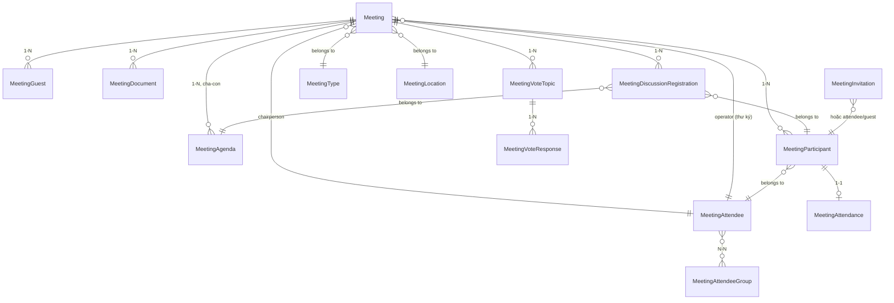

# Module: Meeting (Quản lý cuộc họp)

> Ngày tạo: 11:25:35 19/07/2026
> Cập nhật lần cuối: 11:25:35 19/07/2026

---

## 1. Mục đích nghiệp vụ

Quản lý toàn bộ vòng đời một cuộc họp nội bộ: tạo cuộc họp, mời/quản lý đại biểu, xây dựng chương trình họp (agenda), điểm danh (check-in QR/thủ công), đăng ký phát biểu, biểu quyết trực tuyến, ghi chú cá nhân, quản lý tài liệu và sinh biên bản họp. Người dùng chính là văn thư/thư ký (tạo và điều hành cuộc họp), chủ tọa/thư ký cuộc họp (điều hành trực tiếp trong lúc họp — highlight agenda, mở/đóng biểu quyết) và đại biểu (xem chương trình, điểm danh, biểu quyết, đăng ký phát biểu). Module hỗ trợ cả cuộc họp trực tiếp lẫn có phòng họp online, và có màn hình máy chiếu (projector) cập nhật realtime qua Reverb.

---

## 2. Vị trí trong codebase

```
app/Modules/Meeting/
  Controllers/    ← 19 controller (Meeting, Agenda, Attendee, AttendeeGroup, Attendance, Document,
                     DocumentType, InvitationTemplate, Location, MinutesTemplate, Participant,
                     PersonalNote(+Attachment), Setting, Type, VoteResponse, VoteTopic,
                     DiscussionRegistration(+Attachment))
  Services/       ← CatalogService + 1 service / resource chính
  Models/         ← 21 model (xem mục 3)
  Requests/
  Resources/
  Enums/          ← 10 enum (Status, AttendanceStatus, BallotMode, CatalogStatus, CheckinMethod,
                     DiscussionStatus, DiscussionType, ParticipantResponseStatus, VoteOption, VoteType)
  Routes/         ← 1 file route / resource + notification_config.php
  Events/         ← 16 event, chủ yếu realtime (ShouldBroadcastNow) cho màn hình điều hành/máy chiếu
  Observers/      ← MeetingObserver
  Exports/ Imports/
  Concerns/
  Middleware/     ← đếm view (count.meeting.view)
  Policies/
```

Route prefix: `/meeting`, `/meeting-agendas`, `/meeting-attendees`, `/meeting-locations`... (mỗi resource 1 prefix riêng theo kebab-case).
Namespace: `App\Modules\Meeting`

**Không có** `Jobs/`/`Notifications/` riêng — thông báo/nhắc lịch (nhắc họp sắp tới, mời họp...) đi qua hạ tầng dùng chung `app/Services/Notification/` (`ReminderScheduler`, `NotificationDispatcher`, `NotificationEventConfig` — cấu hình qua route `notification_config.php` trong module). Event trong `Events/` ở đây chủ yếu KHÔNG phải business event kiểu Beneficiary mà là **broadcast event** (`ShouldBroadcastNow`) phục vụ cập nhật UI realtime nhiều client cùng xem (màn hình điều hành, màn chiếu, tab đại biểu) qua channel `PrivateChannel('meeting.{id}')`.

---

## 3. Entities & Models

| Model | Bảng | Mô tả | Multi-tenant |
|---|---|---|---|
| `MeetingType` | `meeting_types` | Danh mục loại cuộc họp | ✓ |
| `MeetingLocation` | `meeting_locations` | Danh mục địa điểm họp | ✓ |
| `MeetingDocumentType` | `meeting_document_types` | Danh mục loại tài liệu | ✓ |
| `MeetingAttendeeGroup` | `meeting_attendee_groups` | Nhóm đại biểu | ✓ |
| `MeetingMinutesTemplate` | `meeting_minutes_templates` | Template biên bản họp | ✗ (dùng chung toàn hệ thống) |
| `MeetingSetting` | `meeting_settings` | Cấu hình cuộc họp — singleton 1 row/tổ chức | ✓ (unique) |
| `MeetingAttendee` | `meeting_attendees` | Danh sách đại biểu cố định của tổ chức (1 user = 1 row/org) | ✓ |
| `Meeting` | `meetings` | Cuộc họp chính | ✓ |
| `MeetingAgenda` | `meeting_agendas` | Chương trình họp, phân cấp cha-con | ✓ |
| `MeetingParticipant` | `meeting_participants` | Đại biểu được mời tham gia 1 cuộc họp cụ thể | ✓ |
| `MeetingGuest` | `meeting_guests` | Khách mời ngoài danh sách đại biểu cố định | ✓ |
| `MeetingInvitation` | `meeting_invitations` | Giấy mời sinh cho participant/attendee/guest | ✓ |
| `MeetingInvitationTemplate` | `meeting_invitation_templates` | Template giấy mời | ✓ |
| `MeetingAttendance` | — | Điểm danh của participant (check-in/thủ công) | ✓ (qua participant) |
| `MeetingDocument` | `meeting_documents` | Tài liệu cuộc họp | ✓ |
| `MeetingDiscussionRegistration` | `meeting_discussion_registrations` | Đăng ký phát biểu/thảo luận | ✓ |
| `MeetingDiscussionRegistrationAttachment` | — | File đính kèm đăng ký phát biểu | ✓ (qua registration) |
| `MeetingVoteTopic` | `meeting_vote_topics` | Chủ đề biểu quyết | ✓ |
| `MeetingVoteResponse` | `meeting_vote_responses` | Phiếu biểu quyết của từng user | ✓ (qua topic) |
| `MeetingPersonalNote` | `meeting_personal_notes` | Ghi chú cá nhân của đại biểu trong cuộc họp | ✓ |
| `MeetingPersonalNoteAttachment` | — | File đính kèm ghi chú cá nhân | ✓ (qua note) |
| `MeetingView` | `meeting_views` | Đếm lượt xem cuộc họp/tài liệu | ✓ |

Chi tiết cột/index xem [`docs/database/Meeting.md`](../../database/Meeting.md).

### Quan hệ giữa entities



### Trường quan trọng cần chú ý

| Model | Trường | Ý nghĩa / Lưu ý |
|---|---|---|
| `Meeting` | `status` | `MeetingStatusEnum` — draft/published/cancelled/completed |
| `Meeting` | `current_meeting_agenda_id` / `current_meeting_discussion_registration_id` | Item đang highlight trên màn hình điều hành/máy chiếu — đổi qua `highlightAgenda`/`highlightDiscussion`, broadcast realtime |
| `Meeting` | `attendance_locked`, `attendance_open_at/close_at` | Kiểm soát cửa sổ điểm danh |
| `Meeting` | `checkin_token` | UUID để FE sinh QR check-in, không lộ ID thật |
| `MeetingAttendee` | — | Là catalog đại biểu **cố định của tổ chức**, khác với `MeetingParticipant` (đại biểu được mời cho 1 cuộc họp cụ thể) — không nhầm 2 khái niệm này |
| `MeetingVoteTopic` | `derivePhase()` | Tính phase biểu quyết (chưa mở/đang mở/đã đóng) runtime, không lưu cột riêng |
| Mọi model có `organization_id` | `organization_id` | Tenant key, không nhận từ client |

---

## 4. Business Rules & Invariants

- `MeetingAttendee` là danh mục đại biểu **cố định theo tổ chức** (UNIQUE `organization_id` + `user_id`); `MeetingParticipant` mới là bản ghi "được mời tham gia cuộc họp X" — một attendee có thể là participant của nhiều meeting khác nhau.
- Chỉ cuộc họp `status = published` mới cho phép điểm danh, đăng ký phát biểu, biểu quyết.
- `attendance_locked = true` hoặc ngoài khung `attendance_open_at`–`attendance_close_at` thì chặn check-in (trừ thao tác `manualCheckin` của người quản lý điểm danh).
- `MeetingMinutesTemplate` không scope theo `organization_id` — dùng chung toàn hệ thống, khác với các danh mục khác của module.
- `current_meeting_agenda_id`/`current_meeting_discussion_registration_id` chỉ được đổi qua action `highlightAgenda`/`highlightDiscussion` của `MeetingController`, luôn kèm broadcast để đồng bộ nhiều client (điều hành, máy chiếu, đại biểu) cùng lúc.

---

## 5. State Machine

### `Meeting.status` (`MeetingStatusEnum`)

| Trạng thái hiện tại | Sự kiện | Trạng thái mới | Điều kiện |
|---|---|---|---|
| `draft` | Publish | `published` | Đủ thông tin bắt buộc (tiêu đề, thời gian) |
| `published` | Hủy | `cancelled` | |
| `published` | Kết thúc sớm (`endEarly`) | `completed` (phase derive) | Set `end_time = now()`, broadcast `MeetingEndedEarly` |
| `published` | Đến `end_time` | `completed` (phase derive, không đổi cột `status`) | Phase tính runtime từ `start_time`/`end_time`, không phải state chuyển DB |
| `cancelled`/`completed` | `reopen` | `published` | Quyền `meetings.changeStatus` |

### `MeetingAttendance.status` (`MeetingAttendanceStatusEnum`)

| Trạng thái hiện tại | Sự kiện | Trạng thái mới | Điều kiện |
|---|---|---|---|
| `pending` | Check-in (QR/token/thủ công) | `present` | Trong khung điểm danh cho phép |
| `pending` | `markAbsent` | `absent` | |
| `present` | `approve`/`reject` (người quản lý) | duyệt hoặc trở lại xử lý | Chỉ áp dụng khi cuộc họp bật duyệt điểm danh |

### `MeetingVoteTopic` phase (derive runtime, không phải cột `status` cố định)

| Trạng thái | Sự kiện | Trạng thái mới |
|---|---|---|
| Chưa mở | `open` | Đang mở (nhận `MeetingVoteResponse`) |
| Đang mở | `close` | Đã đóng (chặn thêm response) |

---

## 6. Luồng nghiệp vụ chính

### 6.1 Tạo & Publish cuộc họp

```
1. Văn thư tạo Meeting (status = draft): title, meeting_type_id, meeting_location_id,
   start_time/end_time, chọn chairperson/operator từ MeetingAttendee.
2. Thêm MeetingAgenda (có thể phân cấp cha-con), mời MeetingParticipant từ MeetingAttendee
   hoặc thêm MeetingGuest cho người ngoài danh sách cố định.
3. MeetingController::store() → MeetingService.
4. Khi publish (status: draft → published): MeetingObserver::saved() gọi
   ReminderScheduler->scheduleFor($meeting) — Meeting implement Remindable, tự tạo reminder
   theo NotificationEventConfig đã cấu hình (nhắc trước N phút/giờ) — không viết Job riêng.
5. MeetingInvitationGenerator sinh MeetingInvitation cho từng participant/guest (dùng
   MeetingInvitationTemplate), có thể export file mời qua exportInvitation.
```

### 6.2 Điều hành cuộc họp (realtime)

```
1. Chủ tọa/thư ký (operator) bấm "Highlight agenda X" → MeetingController::highlightAgenda()
   update current_meeting_agenda_id → broadcast MeetingAgendaHighlighted (ShouldBroadcastNow)
   qua PrivateChannel('meeting.{id}') → mọi client (màn chiếu, tab đại biểu) cập nhật ngay.
2. Tương tự cho highlightDiscussion (chuyển sang phần thảo luận), toggleProjectorFile
   (đổi ảnh/tài liệu hiển thị màn chiếu).
3. Khi cần kết thúc sớm: endEarly() → set end_time = now(), broadcast MeetingEndedEarly.
4. Payload broadcast CHỈ chứa id + field cần thiết tối thiểu — client tự gọi API lấy full data
   nếu cần (tránh leak dữ liệu qua WebSocket, theo CLAUDE.md §Reverb).
```

### 6.3 Điểm danh (Check-in)

```
1. Đại biểu quét QR (checkin_token) hoặc bấm check-in trong app → checkinInMeeting/
   checkinByTokenInMeeting → MeetingAttendanceService tạo/update MeetingAttendance,
   broadcast MeetingAttendanceCheckedIn.
2. Người quản lý điểm danh có thể manualCheckin cho đại biểu không tự thao tác được,
   hoặc markAbsent cho người vắng.
3. Nếu cuộc họp bật chế độ duyệt điểm danh: approve/reject bởi người có quyền
   manageAttendance, broadcast MeetingAttendanceApproved/Rejected.
4. lockAttendance/unlockAttendance khóa cửa sổ điểm danh thủ công ngoài attendance_close_at.
```

### 6.4 Đăng ký phát biểu (Discussion Registration)

```
1. Đại biểu (participant) đăng ký phát biểu tại 1 agenda cụ thể: storeInMeeting() tạo
   MeetingDiscussionRegistration (status = registered), có thể đính kèm file
   (MeetingDiscussionRegistrationAttachment qua MediaService).
2. Điều hành reorder thứ tự phát biểu (reorderInMeeting), highlight người đang phát biểu
   (highlightDiscussion trên Meeting, không phải trên registration) → broadcast
   MeetingDiscussionHighlighted.
3. Khi hoàn tất: complete() → status = completed, broadcast MeetingDiscussionRegistrationCompleted.
4. Các sự kiện Created/Updated/Deleted broadcast để đồng bộ danh sách chờ phát biểu realtime
   cho mọi đại biểu đang xem.
```

### 6.5 Biểu quyết trực tuyến

```
1. Điều hành tạo MeetingVoteTopic gắn với Meeting (câu hỏi, các lựa chọn theo
   MeetingVoteOptionEnum/MeetingBallotModeEnum: công khai/kín).
2. openInMeeting() → broadcast MeetingVoteTopicOpened, đại biểu bắt đầu cast phiếu qua
   POST .../responses → tạo MeetingVoteResponse, broadcast MeetingVoteResponseAdded
   (kết quả realtime nếu ballot mode công khai).
3. closeInMeeting() → broadcast MeetingVoteTopicClosed, chặn nhận thêm response.
4. exportSummaryInMeeting xuất kết quả tổng hợp theo từng topic.
```

### 6.6 Sinh Biên bản họp (Minutes)

```
1. MeetingMinutesTemplate (dùng chung toàn hệ thống, không theo organization_id) định nghĩa
   layout + placeholder biến (xem endpoint /variables).
2. exportMinutes trên Meeting → MeetingMinutesGenerator ghép dữ liệu cuộc họp
   (agenda, attendance, vote result, discussion) vào template → xuất file Word.
```

### 6.7 Quản lý Ghi chú cá nhân & Tài liệu

```
1. Đại biểu tạo MeetingPersonalNote riêng trong cuộc họp (không ai khác xem được — thuộc về
   user hiện tại), có thể đính kèm file, reorder thứ tự.
2. Văn thư upload MeetingDocument cho cuộc họp (qua MediaService), gắn MeetingDocumentType,
   đại biểu xem/tải — mỗi lượt xem/tải tăng MeetingView (đếm qua middleware count.meeting.view).
```

---

## 7. Events & Side-effects

| Event | Khi nào fire | Loại | Kênh |
|---|---|---|---|
| `MeetingAttendanceCheckedIn/Approved/Rejected/Cancelled` | Thao tác điểm danh | `ShouldBroadcastNow` | `PrivateChannel('meeting.{id}')` |
| `MeetingAgendaHighlighted`, `MeetingDiscussionHighlighted`, `MeetingProjectorFileToggled` | Điều hành highlight nội dung | `ShouldBroadcastNow` | Như trên |
| `MeetingEndedEarly` | `endEarly()` | `ShouldBroadcastNow` | Như trên |
| `MeetingParticipantResponded` | Đại biểu phản hồi lời mời (rsvp) | `ShouldBroadcastNow` | Như trên |
| `MeetingVoteTopicOpened/Closed`, `MeetingVoteResponseAdded` | Vòng đời biểu quyết | `ShouldBroadcastNow` | Như trên |
| `MeetingDiscussionRegistrationCreated/Updated/Deleted/Completed` | Vòng đời đăng ký phát biểu | `ShouldBroadcastNow` | Như trên |

**Khác biệt so với Beneficiary:** các Event trong module này chủ yếu phục vụ **realtime UI** (Reverb broadcast), KHÔNG phải business event kiểu ghi audit/gửi notification qua Listener riêng của module. Nhắc lịch cuộc họp sắp diễn ra đi qua `Meeting implements Remindable` + `ReminderScheduler` (hạ tầng chung `app/Services/Notification/`), được `MeetingObserver` kích hoạt ở `saved()` — đúng theo CLAUDE.md §EDA vì đây là chuẩn bị dữ liệu (data-integrity), không phải gửi.

**Bắt buộc:** Authorization channel qua `routes/channels.php` dùng Policy, payload broadcast chỉ chứa ID + field tối thiểu.

---

## 8. Permissions

Định dạng `{resource}.{action}` — resource theo kebab-case của route prefix. Bộ action đầy đủ cho resource danh mục: `index/show/store/update/destroy/bulkDestroy/bulkUpdateStatus/changeStatus/export/import/stats` — áp dụng cho `meeting-types`, `meeting-locations`, `meeting-document-types`, `meeting-attendee-groups`, `meeting-attendees`.

| Permission key (mẫu) | Mô tả |
|---|---|
| `meetings.index/.show/.store/.update/.destroy` | CRUD cuộc họp |
| `meetings.bulkDestroy/.bulkUpdateStatus/.changeStatus/.export/.stats` | Thao tác hàng loạt/đổi trạng thái/xuất/thống kê |
| `meeting-agendas.*` | CRUD chương trình họp (không có `changeStatus` — agenda không có cột status độc lập ở mức đổi trạng thái nghiệp vụ) |
| `meeting-documents.*` | CRUD tài liệu cuộc họp |
| `meeting-vote-topics.*`, `meeting-participants.*` | CRUD chủ đề biểu quyết, đại biểu tham gia |
| `meeting-invitation-templates.*`, `meeting-minutes-templates.*` | CRUD template giấy mời/biên bản |
| `meeting-settings.update` | Cập nhật cấu hình cuộc họp (singleton, không có `.store`/`.destroy`) |

Nhiều action điều hành realtime (`highlightAgenda`, `endEarly`, `lockAttendance`...) dùng Policy (`can:...,meeting`) thay vì permission string trực tiếp — xem `app/Modules/Meeting/Policies/`.

---

## 9. API Endpoints

Định nghĩa tại `app/Modules/Meeting/Routes/*.php` (mỗi resource 1 file). Tóm tắt nhóm chính:

| Method | Path (mẫu) | Mô tả |
|---|---|---|
| `GET/POST/PUT/DELETE` | `/api/meetings`, `/{id}` | CRUD cuộc họp + `stats`, `export`, `bulk-delete`, `bulk-status` |
| `PATCH` | `/api/meetings/{id}/status`, `/reopen`, `/lock-attendance`, `/unlock-attendance`, `/end-early`, `/highlight-agenda`, `/highlight-discussion`, `/toggle-projector-file` | Điều hành cuộc họp |
| `POST` | `/api/meetings/{id}/duplicate`, `/export-minutes` | Nhân bản, xuất biên bản |
| `GET` | `/api/meetings/{id}/qr-token`, `/minutes-templates` | Lấy token QR check-in, danh sách template khả dụng |
| `*` | `/api/meetings/{id}/discussion-registrations/...` | Đăng ký phát biểu (nested resource) |
| `*` | `/api/meetings/{id}/vote-topics/...`, `/vote-responses/...` | Biểu quyết (nested resource) |
| `*` | `/api/meetings/{id}/attendances/...` | Điểm danh (nested resource) |
| `*` | `/api/meetings/{id}/participants/...`, `/personal-notes/...` | Đại biểu tham gia, ghi chú cá nhân (nested resource) |
| `*` | `/api/meeting-types`, `/meeting-locations`, `/meeting-document-types`, `/meeting-attendee-groups`, `/meeting-attendees`, `/meeting-documents`, `/meeting-agendas`, `/meeting-invitation-templates`, `/meeting-minutes-templates` | CRUD danh mục — bộ chuẩn CLAUDE.md §3 |
| `GET/POST` | `/api/meeting/event-configs`, `/logs` | Cấu hình & log thông báo module (hạ tầng Notification chung) |

---

## 10. Phụ thuộc module khác

| Phụ thuộc | Dùng gì | Ghi chú |
|---|---|---|
| `Core` | `MediaService` (upload tài liệu/ghi chú/máy chiếu), `Organization`, `User`, `PermissionSeeder` | Không gọi `addMedia()`/`Storage::put` trực tiếp |
| `Notification engine` (`app/Services/Notification/`) | `NotificationDispatcher`, `ReminderScheduler`, `Remindable` contract, `NotificationEventConfig` | `Meeting implements Remindable`; Observer fire `scheduleFor()`, không viết Job/Notification riêng |
| Reverb (Broadcast) | `PrivateChannel('meeting.{id}')` | Toàn bộ 16 Event trong module là broadcast realtime |

---

## 11. Điểm dễ gây lỗi khi maintain

- **Đừng nhầm `MeetingAttendee` với `MeetingParticipant`** — attendee là catalog cố định của tổ chức, participant là bản ghi mời cho 1 cuộc họp cụ thể. Đổi status của attendee không ảnh hưởng participant đã tạo trước đó.
- **Events trong module này chủ yếu là broadcast UI, không phải business event có Listener xử lý nghiệp vụ** — nếu cần thêm side-effect nghiệp vụ (vd ghi log khi vote), không tự động có Listener nào lắng nghe các Event này, phải viết thêm.
- **`meeting_minutes_templates` không có `organization_id`** — dùng chung toàn hệ thống, khác với đa số danh mục khác trong module (dễ nhầm khi viết query lọc theo tenant).
- **`current_meeting_agenda_id`/`current_meeting_discussion_registration_id`** chỉ nên đổi qua đúng 2 action highlight, không update trực tiếp ở nơi khác — sẽ làm mất đồng bộ broadcast.
- **`MeetingVoteTopic` không lưu cột `phase`/`status` cố định** — luôn tính qua `derivePhase()`, không query trực tiếp trạng thái mở/đóng theo cột DB.

---

## 12. Câu hỏi thường gặp

**Q:** Tại sao module này không có `Jobs/`/`Notifications/` riêng như Beneficiary mô tả?
**A:** Vì nhắc lịch họp dùng lại đúng hạ tầng `ReminderScheduler`/`NotificationDispatcher` chung — `Meeting` chỉ cần implement `Remindable`. Các Event riêng của module (16 event trong `Events/`) phục vụ mục đích khác — broadcast realtime UI, không phải gửi thông báo.

**Q:** Vì sao hầu hết Event của Meeting dùng `ShouldBroadcastNow` thay vì `ShouldDispatchAfterCommit`?
**A:** Vì đây là tương tác điều hành trực tiếp trong lúc họp (highlight, check-in, vote) cần phản hồi UI ngay lập tức cho nhiều client đang xem — không phải luồng ghi DB rồi gửi notification bất đồng bộ như Beneficiary, nên không cần đợi transaction commit theo cùng quy tắc.
