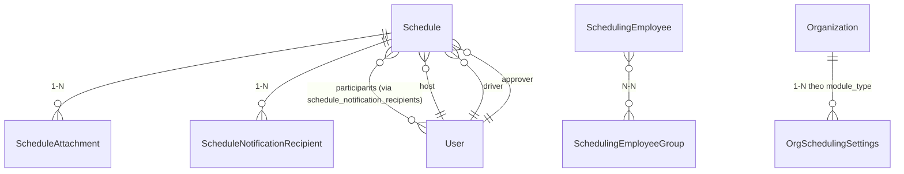

# Module: Scheduling (Lịch công tác)

> Ngày tạo: 11:25:35 19/07/2026
> Cập nhật lần cuối: 11:25:35 19/07/2026

---

## 1. Mục đích nghiệp vụ

Quản lý lịch công tác tuần của lãnh đạo/cơ quan, chia làm 2 loại: `EXECUTIVE` (lịch Thường trực — lãnh đạo cấp cao) và `OFFICE` (lịch Văn phòng). Người dùng chính là văn thư/thư ký sắp lịch, lãnh đạo (chủ trì/tham dự), lái xe (xem lịch có bố trí xe), và toàn cơ quan (xem lịch chung theo tuần). Module hỗ trợ soạn lịch theo buổi (sáng/chiều/tối), duyệt lịch (tùy cấu hình tổ chức), xuất lịch tuần dạng bảng (PDF/Word/Excel) và nhắc lịch tự động trước giờ diễn ra.

---

## 2. Vị trí trong codebase

```
app/Modules/Scheduling/
  Controllers/    ← Schedule, SchedulingEmployee, SchedulingEmployeeGroup, SchedulingSetting
  Services/       ← ScheduleService, SchedulingEmployeeService, SchedulingEmployeeGroupService,
                     SchedulingSettingService, SchedulingFilterPresetService
  Models/         ← 8 model (xem mục 3)
  Requests/
  Resources/
  Enums/          ← 13 enum — LƯU Ý có cặp enum trùng ý nghĩa khác quy ước (xem mục 11)
  Routes/         ← schedule.php, scheduling_employee.php, scheduling_employee_group.php,
                     scheduling_setting.php, notification_config.php
  Observers/      ← ScheduleObserver (chuẩn bị reminder — data integrity, không gửi)
  Exports/ Imports/
  Middleware/     ← schedule.module (kiểm tra quyền theo module_type EXECUTIVE/OFFICE)
  Policies/       ← SchedulePolicy
```

Route prefix: `/schedules`, `/scheduling-employees`, `/scheduling-employee-groups`, `/scheduling-settings`.
Namespace: `App\Modules\Scheduling`

**Không có** `Events/`/`Jobs/`/`Notifications/` riêng trong module — Event nghiệp vụ (`SchedulePublished`, `ScheduleUpdated`, `ScheduleCancelled`) được định nghĩa và fire thẳng ở hạ tầng dùng chung `App\Services\Notification\Events\*` ngay trong `ScheduleService` (1 đường ghi duy nhất qua Service). `ScheduleObserver` chỉ lo phần data-integrity: gọi `ReminderScheduler->scheduleFor()`/`cancelPending()` khi status đổi hoặc `date_time` đổi — không tự gửi thông báo.

---

## 3. Entities & Models

| Model | Bảng | Mô tả | Multi-tenant |
|---|---|---|---|
| `Schedule` | `schedules` | Lịch công tác chính | ✓ |
| `ScheduleAttachment` | `schedule_attachments` | File đính kèm lịch | ✗ (theo qua `schedule_id`) |
| `ScheduleNotificationRecipient` | `schedule_notification_recipients` | Người/nhóm nhận thông báo riêng cho 1 lịch | ✗ (theo qua `schedule_id`) |
| `ScheduleParticipant` | — | Người tham dự lịch | ✗ (theo qua `schedule_id`) |
| `SchedulingEmployee` | — | Nhân sự tham gia sắp lịch (lớp gate giữa `users` và module) | ✓ |
| `SchedulingEmployeeGroup` | — | Nhóm nhân sự (dùng để chọn nhanh nhiều người khi tạo lịch) | ✓ |
| `SchedulingSetting` | — | Cấu hình chung module (theo user hoặc theo tổ chức tùy field) | — |
| `OrgSchedulingSettings` | `org_scheduling_settings` | Cấu hình bật/tắt duyệt lịch theo `module_type` của từng tổ chức | ✓ (qua `organization_id`) |

Chi tiết cột/index xem [`docs/database/Scheduling.md`](../../database/Scheduling.md).

### Quan hệ giữa entities



### Trường quan trọng cần chú ý

| Model | Trường | Ý nghĩa / Lưu ý |
|---|---|---|
| `Schedule` | `module_type` | `EXECUTIVE`/`OFFICE` — quyết định bộ quyền qua middleware `schedule.module:{action}`, KHÔNG tách route riêng cho 2 loại |
| `Schedule` | `status` | `0 DRAFT / 1 PUBLISHED` (kiểu **int**, không phải string như đa số module khác) |
| `Schedule` | `approval_status` | `null`/`pending`/`approved`/`rejected` — chỉ áp dụng khi `org_scheduling_settings` bật duyệt cho `module_type` tương ứng của tổ chức |
| `Schedule` | `week_number`/`year` | ISO week/year tự tính từ `date_time` — dùng để group hiển thị lịch tuần, không tính lại runtime |
| `Schedule` | `session` | Buổi trong ngày, lưu dạng ký tự ngắn `S`/`C`/`T` (Sáng/Chiều/Tối) theo `SessionType`, khác `ScheduleSessionEnum` (MORNING/AFTERNOON/EVENING/ALL_DAY) dùng ở chỗ khác |
| Mọi model có `organization_id` | `organization_id` | Tenant key, không nhận từ client |

---

## 4. Business Rules & Invariants

- `Schedule.module_type` (`EXECUTIVE`/`OFFICE`) không tách thành 2 route/2 controller riêng — cùng 1 `ScheduleController`, phân quyền qua middleware `schedule.module:{action}` đọc `module_type` từ request/query.
- Duyệt lịch (`approval_status`) chỉ bật khi `OrgSchedulingSettings` của tổ chức bật cờ duyệt cho `module_type` tương ứng — tổ chức không bật thì `approval_status` luôn `null`, action `approve`/`reject` không áp dụng.
- Chỉ `Schedule.status = PUBLISHED` (giá trị 1) mới lên lịch nhắc (`ReminderScheduler`); chuyển về `DRAFT` hoặc bất kỳ trạng thái không-published nào → hủy các reminder đang chờ (`cancelPending()`).
- `date_time` đổi khi lịch đã `PUBLISHED` → phải tính lại `remind_at` cho toàn bộ reminder liên quan (`scheduleFor()` gọi lại), không chỉ tạo thêm.
- Chỉ các field nằm trong danh sách `NOTIFY_FIELDS` (`content`, `date_time`, `location`) đổi trên lịch đã published mới coi là "cập nhật đáng thông báo" (`ScheduleUpdated`) — đổi field khác không fire event thông báo lại cho người tham dự.
- `SchedulingEmployee` là lớp gate: chỉ nhân sự có mặt trong bảng này (status active) mới được chọn làm host/driver/participant khi tạo lịch.

---

## 5. State Machine

### `Schedule.status` (publish status — kiểu int)

| Trạng thái hiện tại | Sự kiện | Trạng thái mới | Điều kiện |
|---|---|---|---|
| `0 DRAFT` | Publish (`changeStatus`) | `1 PUBLISHED` | Đủ thông tin bắt buộc — fire `SchedulePublished`, `ScheduleObserver` lên lịch nhắc |
| `1 PUBLISHED` | Chuyển về draft | `0 DRAFT` | Fire `ScheduleCancelled` (huỷ nhắc đang chờ) |

### `Schedule.approval_status` (chỉ khi tổ chức bật duyệt)

| Trạng thái hiện tại | Sự kiện | Trạng thái mới | Điều kiện |
|---|---|---|---|
| `null`/`pending` | `approve()` | `approved` | Người duyệt có quyền `schedule.module:approve` |
| `pending` | `reject()` | `rejected` | Bắt buộc nhập `rejection_note` |
| `rejected` | Sửa lại & gửi duyệt lại | `pending` | Người tạo chỉnh sửa, submit lại |

---

## 6. Luồng nghiệp vụ chính

### 6.1 Tạo & Publish lịch công tác

```
1. Văn thư tạo Schedule: module_type (EXECUTIVE/OFFICE), content, date_time, session (S/C/T),
   nature (HOST/ATTEND), host_id/host_text, driver_id/driver_text, đính kèm file
   (ScheduleAttachment qua MediaService), chọn participants/recipients (cá nhân hoặc nhóm).
2. ScheduleService::store() trong DB::transaction() (ghi nhiều bảng phụ thuộc: schedule +
   attachments + notification_recipients).
3. Nếu status = PUBLISHED ngay khi tạo → Event::dispatch(SchedulePublished($schedule)) fire
   TRỰC TIẾP trong Service (1 đường ghi duy nhất qua Service, không cần Observer).
4. ScheduleObserver::saved() phát hiện chuyển draft → published → gọi
   ReminderScheduler->scheduleFor($schedule) — Schedule implement Remindable, tự tạo reminder
   theo NotificationEventConfig của tổ chức. Đây là 2 side-effect ĐỘC LẬP cho cùng 1 sự kiện:
   Service lo "báo tin đã publish" (SchedulePublished → Listener gửi), Observer lo "chuẩn bị
   reminder cho việc nhắc trước giờ" (data integrity, không gửi).
```

### 6.2 Cập nhật lịch đã publish

```
1. Văn thư sửa Schedule đã published (đổi content/date_time/location/...).
2. ScheduleService::update() so sánh field đổi (wasChanged), nếu có field thuộc NOTIFY_FIELDS
   → Event::dispatch(ScheduleUpdated($schedule, $changedFields)) TRỰC TIẾP trong Service.
3. ScheduleObserver::saved() phát hiện wasChanged('date_time') khi vẫn đang published →
   gọi lại scheduleFor() để tính lại remind_at cho toàn bộ reminder — KHÔNG tạo trùng,
   ReminderScheduler tự xử lý idempotent theo remindable.
```

### 6.3 Hủy / Chuyển về Draft

```
1. Văn thư đổi status PUBLISHED → DRAFT, hoặc destroy() lịch đang published.
2. ScheduleService fire Event::dispatch(ScheduleCancelled($schedule)) trực tiếp trong Service
   (thông báo huỷ cho người tham dự).
3. ScheduleObserver::saved()/deleted() phát hiện published → không-published →
   gọi scheduler->cancelPending($schedule) hủy mọi reminder đang chờ gửi.
```

### 6.4 Duyệt lịch (khi tổ chức bật approval)

```
1. Kiểm tra OrgSchedulingSettings của tổ chức có bật duyệt cho module_type tương ứng không.
2. Nếu bật: tạo/publish lịch → approval_status = pending, người có quyền approve xem danh sách
   chờ duyệt → approve() (approval_status = approved, ghi approved_by/approved_at) hoặc
   reject() (approval_status = rejected, bắt buộc rejection_note).
3. Nếu tổ chức không bật duyệt: lịch publish thẳng, approval_status luôn null, bỏ qua bước này.
```

### 6.5 Xem lịch tuần & Xuất báo cáo

```
1. weekMatrix()/driverWeekMatrix() trả lịch theo ma trận ngày × buổi (S/C/T) cho 1 tuần
   (group theo week_number/year đã tính sẵn, không tính lại từ date_time).
2. driver-view riêng cho lái xe — chỉ thấy lịch có driver_id/driver_text được gán.
3. export/exportPdf/exportWord xuất lịch tuần theo định dạng bảng chuẩn văn thư
   (không phải Excel danh sách phẳng như các module khác).
4. reorder() cho phép sắp xếp lại thứ tự hiển thị (sort_order) trong cùng ngày + buổi.
```

---

## 7. Events & Side-effects

| Event | Khi nào fire | Nơi fire | Có gửi thông báo? |
|---|---|---|---|
| `App\Services\Notification\Events\SchedulePublished` | Lịch chuyển sang `PUBLISHED` | Trực tiếp trong `ScheduleService` (1 đường ghi duy nhất) | Có — nhắc người tham dự lịch mới |
| `App\Services\Notification\Events\ScheduleUpdated` | Field trong `NOTIFY_FIELDS` đổi khi đã published | Trực tiếp trong `ScheduleService` | Có — báo lịch có thay đổi |
| `App\Services\Notification\Events\ScheduleCancelled` | Lịch published bị hủy/xóa/chuyển về draft | Trực tiếp trong `ScheduleService` | Có — báo hủy lịch |
| Reminder trước giờ diễn ra | `ReminderScheduler->scheduleFor()` do `ScheduleObserver` gọi mỗi khi `saved()` phát hiện published mới hoặc `date_time` đổi | `ScheduleObserver` (data-integrity, KHÔNG tự gửi) | Có — qua `ProcessRemindersCommand` chung khi đến `remind_at` |

**Quy tắc chọn nơi fire (nhắc lại CLAUDE.md §EDA):** `Schedule` chỉ có 1 đường ghi qua `ScheduleService` (không có Seeder/Console nào ghi trực tiếp `status`) → Event nghiệp vụ (`SchedulePublished`/`Updated`/`Cancelled`) fire thẳng trong Service. Việc chuẩn bị reminder vẫn tách qua Observer vì đó là data-integrity áp dụng theo trạng thái model (không phải 1 hành động nghiệp vụ đơn lẻ) và cần chạy lại mỗi khi `date_time` đổi, không chỉ lúc publish.

---

## 8. Permissions

Đa số action dùng permission key `{resource}.{action}` chuẩn, riêng `Schedule` dùng thêm middleware `schedule.module:{action}` (kiểm tra theo `module_type` của lịch, không chỉ permission tĩnh):

| Permission key / middleware | Mô tả |
|---|---|
| `schedule.module:index/show/store/update/destroy/export/approve/changeStatus/stats` | CRUD + duyệt + xuất lịch, tách quyền theo `module_type` (EXECUTIVE/OFFICE) |
| `scheduling-employees.index/.show/.store/.update/.destroy/.export/.import/.bulkDestroy/.bulkUpdateStatus/.changeStatus/.stats` | CRUD nhân sự sắp lịch |
| `scheduling-employee-groups.*` (bộ tương tự) | CRUD nhóm nhân sự |
| `scheduling-settings.update` | Cập nhật cấu hình module (không có `.store`/`.destroy`) |

---

## 9. API Endpoints

Định nghĩa tại `app/Modules/Scheduling/Routes/*.php`. Tóm tắt:

| Method | Path | Mô tả |
|---|---|---|
| `GET` | `/api/schedules`, `/{id}`, `/stats`, `/weekly-matrix`, `/weeks`, `/week-counts` | Danh sách, chi tiết, ma trận tuần |
| `GET` | `/api/schedules/driver-view`, `/driver-view/{id}` | Góc nhìn lái xe |
| `GET` | `/api/schedules/general`, `/general/weekly-matrix`, `/general/weeks` | Lịch chung toàn cơ quan |
| `GET` | `/api/schedules/export`, `/export-pdf`, `/export-word` | Xuất lịch tuần |
| `POST/PUT/PATCH/DELETE` | `/api/schedules`, `/{id}` | CRUD lịch |
| `PATCH` | `/api/schedules/{id}/status`, `/approve`, `/reject`, `/reorder`, `bulk-status` | Đổi trạng thái/duyệt/sắp xếp |
| `POST` | `/api/schedules/{id}/duplicate` | Nhân bản lịch |
| `DELETE` | `/api/schedules/bulk-delete` | Xóa hàng loạt |
| `*` | `/api/scheduling-employees`, `/scheduling-employee-groups` | CRUD nhân sự & nhóm — bộ chuẩn CLAUDE.md §3, thêm `sync-groups`/`sync-members` |
| `GET/POST` | `/api/scheduling-settings` | Xem/cập nhật cấu hình (singleton) |
| `GET/POST` | `/api/scheduling/event-configs`, `/logs` | Cấu hình & log thông báo module (hạ tầng chung) |

---

## 10. Phụ thuộc module khác

| Phụ thuộc | Dùng gì | Ghi chú |
|---|---|---|
| `Core` | `MediaService` (đính kèm file lịch), `Organization`, `User`, `PermissionSeeder` | Không gọi `addMedia()`/`Storage::put` trực tiếp |
| `Notification engine` (`app/Services/Notification/`) | `NotificationDispatcher`, `ReminderScheduler`, `Remindable` contract, `Events\SchedulePublished/Updated/Cancelled`, `NotificationEventConfig` | `Schedule implements Remindable`; Event nghiệp vụ định nghĩa Ở NGOÀI module (namespace `App\Services\Notification\Events`), không đặt trong `app/Modules/Scheduling/Events/` |

---

## 11. Điểm dễ gây lỗi khi maintain

- **Enum trùng lặp/dễ nhầm:** `ScheduleStatus` (int 0/1, dùng thực tế trong `ScheduleObserver`/`Schedule.status`) khác `ScheduleStatusEnum` (string DRAFT/PUBLISHED, dùng ở request validate `ChangeStatusScheduleRequest`/`BulkUpdateStatusScheduleRequest`); `SessionType` (S/C/T, dùng thực tế trong cột `session`) khác `ScheduleSessionEnum` (MORNING/AFTERNOON/EVENING/ALL_DAY). Khi sửa code, phải xác nhận đang import đúng enum nào — dùng nhầm enum tương tự tên sẽ không lỗi cú pháp nhưng sai giá trị runtime.
- **Event nghiệp vụ (`SchedulePublished`...) không nằm trong `app/Modules/Scheduling/Events/`** (thư mục này thậm chí không tồn tại) — nằm ở `app/Services/Notification/Events/`, dễ tìm nhầm chỗ khi cần thêm Listener.
- **`Schedule.status` là kiểu int**, khác quy ước string status phổ biến ở các module khác (Meeting, TaskAssignment...) — so sánh/migrate dữ liệu cần chú ý kiểu.
- **`approval_status` có thể `null`** — luôn kiểm tra `OrgSchedulingSettings` trước khi giả định lịch cần duyệt, đừng suy luận từ giá trị hiện tại của `approval_status` một mình.

---

## 12. Câu hỏi thường gặp

**Q:** Tại sao Event nghiệp vụ (`SchedulePublished`, `ScheduleUpdated`, `ScheduleCancelled`) không đặt trong module Scheduling mà đặt ở `app/Services/Notification/Events/`?
**A:** Đây là quyết định kiến trúc đã có từ trước khi tài liệu này được viết — các Event này được hạ tầng Notification chung định nghĩa để dùng lại pattern build nội dung/gửi thống nhất giữa các module (tương tự cách Meeting/TaskAssignment cũng dùng chung `NotificationEventConfig`). Khi thêm Listener mới cho các Event này, tìm ở `app/Services/Notification/Listeners/`, không tìm trong `app/Modules/Scheduling/`.

**Q:** Vì sao `ScheduleObserver` vẫn cần tồn tại dù Event nghiệp vụ đã fire thẳng trong Service (chỉ có 1 đường ghi)?
**A:** Vì việc "chuẩn bị reminder" phải chạy lại mỗi khi `date_time` đổi (không chỉ đúng 1 lần lúc publish), và về bản chất là data-integrity theo CLAUDE.md §EDA ("chuẩn bị dữ liệu ≠ gửi") — tách khỏi Service để Service chỉ tập trung vào ý nghĩa nghiệp vụ (publish/update/cancel), không lẫn logic tính lại lịch nhắc.
