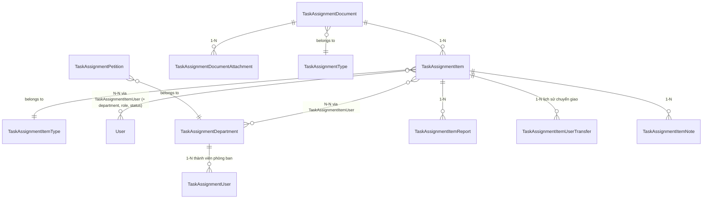

# Module: TaskAssignment (Giao việc liên phòng ban)

> Ngày tạo: 11:25:35 19/07/2026
> Cập nhật lần cuối: 11:25:35 19/07/2026

---

## 1. Mục đích nghiệp vụ

Quản lý việc giao và theo dõi công việc liên phòng ban, xuất phát từ văn bản chỉ đạo (Document) hoặc đơn thư/kiến nghị (Petition). Người dùng chính là lãnh đạo/văn thư (ban hành văn bản, giao việc), trưởng phòng/nhân viên (nhận việc, báo cáo tiến độ, chuyển giao việc cho người khác), và bộ phận tiếp nhận đơn thư. Module theo dõi tiến độ (`processing_status`), hạn xử lý, phân loại ưu tiên, lịch sử chuyển giao và cảnh báo quá hạn/sắp đến hạn.

---

## 2. Vị trí trong codebase

```
app/Modules/TaskAssignment/
  Controllers/    ← Department, Document, Employee, Item, ItemReport, ItemType, Note,
                     Petition, Transfer, Type
  Services/       ← Department, Document, Employee, Item, Lookup, Note, Petition,
                     Report, Timeline, Transfer
  Models/         ← 16 model (xem mục 3)
  Requests/
  Resources/
  Enums/          ← PetitionStatus, TaskAssignmentDocumentStatus, TaskAssignmentRole,
                     TaskDeadlineType, TaskPriority, TaskProgressStatus,
                     TaskUserAssignmentRole, TaskUserAssignmentStatus
  Routes/         ← 1 file / resource + notification_config.php
  Observers/      ← TaskAssignmentItemObserver (chuẩn bị reminder — data integrity)
  Exports/ Imports/
  Policies/
```

Route prefix: `/task-assignment-departments`, `/task-assignment-documents`, `/task-assignment-items`, `/task-assignment-petitions`...
Namespace: `App\Modules\TaskAssignment`

**Không có** `Events/`/`Jobs/`/`Notifications/` riêng trong module — Event nghiệp vụ (`DocumentIssued`, `TaskAssigned`, `TaskConfirmed`, `TaskCompleted`) được định nghĩa ở hạ tầng dùng chung `App\Services\Notification\Events\*` và fire thẳng trong Service (`TaskAssignmentDocumentService`, `TaskAssignmentItemService`, `TaskAssignmentTransferService`) — cùng pattern với module Scheduling.

---

## 3. Entities & Models

| Model | Bảng | Mô tả | Multi-tenant |
|---|---|---|---|
| `TaskAssignmentDepartment` | `task_assignment_departments` | Phòng ban nội bộ phục vụ giao việc | ✓ (nullable) |
| `TaskAssignmentEmployee` | `task_assignment_employees` | Lớp gate: chỉ user nằm ở đây (active) mới được gán vào dept/task | ✓ (nullable) |
| `TaskAssignmentType` | `task_assignment_types` | Loại văn bản giao việc | ✓ (nullable) |
| `TaskAssignmentItemType` | `task_assignment_item_types` | Loại công việc | ✓ (nullable) |
| `TaskAssignmentDocument` | `task_assignment_documents` | Văn bản giao việc (draft/issued) | ✓ (nullable) |
| `TaskAssignmentDocumentAttachment` | `task_assignment_document_attachments` | File đính kèm văn bản | ✗ (theo qua document) |
| `TaskAssignmentItem` | `task_assignment_items` | Công việc cụ thể thuộc 1 văn bản | ✓ (nullable) |
| `TaskAssignmentItemUser` | `task_assignment_item_user` | Pivot: công việc ↔ user (+ department, role, status) | — (Pivot) |
| `TaskAssignmentItemUserTransfer` | `task_assignment_item_user_transfers` | Lịch sử chuyển giao công việc giữa người dùng | ✓ (nullable) |
| `TaskAssignmentItemReport` | `task_assignment_item_reports` | Báo cáo tiến độ công việc | ✓ (nullable) |
| `TaskAssignmentItemReportAttachment` | — | File đính kèm báo cáo | ✗ (theo qua report) |
| `TaskAssignmentItemNote` | `task_assignment_item_notes` | Ghi chú/trao đổi trên công việc | ✓ (nullable) |
| `TaskAssignmentPetition` | `task_assignment_petitions` | Đơn thư/kiến nghị | ✓ (nullable) |
| `TaskAssignmentPetitionAttachment` | — | File đính kèm đơn thư | ✗ (theo qua petition) |
| `TaskAssignmentUser` | — | Thành viên phòng ban (pivot user ↔ department mức dept, khác `TaskAssignmentItemUser` mức item) | ✓ (nullable) |

Chi tiết cột/index xem [`docs/database/TaskAssignment.md`](../../database/TaskAssignment.md).

### Quan hệ giữa entities



### Trường quan trọng cần chú ý

| Model | Trường | Ý nghĩa / Lưu ý |
|---|---|---|
| `TaskAssignmentDocument` | `status` | `draft`/`issued` — chỉ khi `issued` mới cho phép reminder deadline của các item con hoạt động |
| `TaskAssignmentItem` | `processing_status` | `TaskProgressStatusEnum` — todo/in_progress/pending_approval/done/paused/cancelled |
| `TaskAssignmentItem` | `deadline_type` | `has_deadline`/`no_deadline` — item `no_deadline` không tham gia luồng nhắc hạn |
| `TaskAssignmentItem` | `completion_percent` | 0-100, đạt 100 kèm nộp báo cáo → `reported_at`/`reported_by` |
| `TaskAssignmentItem` | `rejection_reason` | Chỉ có giá trị khi bị `reject()` từ `pending_approval` quay lại `todo` |
| `TaskAssignmentItemUser` | `assignment_role`/`assignment_status` | `main`/`support` và `assigned`/`accepted`/`rejected`/`done` — 1 item có thể nhiều người, chỉ 1 vai trò `main` nên là người chịu trách nhiệm chính |
| `TaskAssignmentPetition` | `status` | `PetitionStatusEnum` — new/processing/completed/paused/cancelled |
| Mọi model có `organization_id` | `organization_id` | Tenant key, nullable ở một số bảng danh mục dùng chung |

---

## 4. Business Rules & Invariants

- `TaskAssignmentEmployee` là lớp gate bắt buộc: chỉ user có mặt trong bảng này (status active) mới được gán làm thành viên phòng ban hoặc người thực hiện công việc — không gán trực tiếp `User` bất kỳ.
- `TaskAssignmentItem` chỉ vào luồng nhắc hạn (reminder) khi ĐỒNG THỜI: văn bản cha (`document.status = issued`) và item có `deadline_type = has_deadline`. Item thuộc văn bản còn `draft` không được nhắc dù có `end_at`.
- Khi `processing_status` chuyển sang `done`, mọi reminder đang chờ của item đó bị hủy ngay (không còn ý nghĩa nhắc hạn công việc đã xong).
- Chuyển từ `pending_approval` về `todo` (reject) bắt buộc có `rejection_reason`.
- Chuyển giao công việc (`TaskAssignmentItemUserTransfer`) luôn ghi lại lịch sử đầy đủ (from/to user, người thực hiện chuyển, phòng ban đích) — không update trực tiếp `TaskAssignmentItemUser` mà mất dấu vết ai đã từng phụ trách.
- `TaskAssignmentDepartment.is_petition_overview = true` đánh dấu phòng ban nhận đơn thư tổng hợp — dùng để định tuyến `TaskAssignmentPetition` mặc định.

---

## 5. State Machine

### `TaskAssignmentDocument.status`

| Trạng thái hiện tại | Sự kiện | Trạng thái mới | Điều kiện |
|---|---|---|---|
| `draft` | Ban hành | `issued` | Fire `DocumentIssued`; kích hoạt reminder cho các item con `has_deadline` |

### `TaskAssignmentItem.processing_status` (`TaskProgressStatusEnum`)

| Trạng thái hiện tại | Sự kiện | Trạng thái mới | Điều kiện |
|---|---|---|---|
| `todo` | Nhận việc/bắt đầu | `in_progress` | |
| `in_progress` | Nộp báo cáo đạt 100% (`markDone`/nộp report) | `pending_approval` | Ghi `reported_at`, `reported_by` |
| `pending_approval` | Người duyệt `approve` | `done` | Ghi `completed_at`, `approved_by`; fire `TaskCompleted`; hủy reminder đang chờ |
| `pending_approval` | `reject` | `todo` | Bắt buộc `rejection_reason` |
| `in_progress`/`todo` | `paused`/`reopen` | `paused` / trở lại trạng thái trước | |
| Bất kỳ (trừ `done`) | Hủy | `cancelled` | |

### `TaskAssignmentPetition.status` (`PetitionStatusEnum`)

| Trạng thái hiện tại | Sự kiện | Trạng thái mới | Điều kiện |
|---|---|---|---|
| `new` | Tiếp nhận xử lý | `processing` | |
| `processing` | Hoàn tất | `completed` | |
| `processing` | Tạm dừng/Hủy | `paused` / `cancelled` | |

---

## 6. Luồng nghiệp vụ chính

### 6.1 Ban hành văn bản & Tạo công việc

```
1. Văn thư tạo TaskAssignmentDocument (status = draft): name, task_assignment_type_id,
   summary, issue_date, đính kèm file (TaskAssignmentDocumentAttachment qua MediaService).
2. Thêm các TaskAssignmentItem thuộc văn bản: name, item_type, deadline_type, start_at/end_at,
   priority, gán người thực hiện qua TaskAssignmentItemUser (chọn role main/support).
3. Khi ban hành (status: draft → issued): TaskAssignmentDocumentService fire
   event(new DocumentIssued($document)) TRỰC TIẾP trong Service (1 đường ghi duy nhất).
4. TaskAssignmentItemObserver::saved() trên từng item con phát hiện document đã issued VÀ
   item wasChanged(['end_at','processing_status','deadline_type']) → gọi
   scheduler->scheduleFor($item) để lên lịch nhắc hạn (item mới tạo tự gọi từ Service SAU
   transaction để tránh deadlock, không dựa vào Observer cho trường hợp tạo mới).
5. Với mỗi user được gán vào item: event(new TaskAssigned($item, $user)) fire trong Service
   → Listener gửi thông báo giao việc.
```

### 6.2 Thực hiện & Báo cáo tiến độ

```
1. Người được giao cập nhật processing_status: todo → in_progress (updateProgress()).
2. Khi hoàn thành, nộp TaskAssignmentItemReport (đính kèm minh chứng qua MediaService) →
   item chuyển pending_approval, ghi reported_at/reported_by.
3. Người duyệt (thường là người giao việc/trưởng phòng) xem báo cáo:
   - approve()/markDone() → processing_status = done, completed_at/approved_by, fire
     event(new TaskCompleted($item)); TaskAssignmentItemObserver hủy reminder đang chờ.
   - reject() → quay lại todo, bắt buộc rejection_reason, người thực hiện làm lại.
4. TaskAssignmentItemNote cho phép trao đổi/ghi chú qua lại trong lúc xử lý, không đổi
   processing_status.
```

### 6.3 Chuyển giao công việc (Transfer)

```
1. Người phụ trách hiện tại (hoặc quản lý) chọn chuyển việc sang người/phòng ban khác:
   TaskAssignmentTransferService tạo TaskAssignmentItemUserTransfer (from_user, to_user,
   transferred_by, transferred_department_id) trong DB::transaction() cùng lúc update
   TaskAssignmentItemUser (đổi assignment_status = transferred cho người cũ, tạo bản ghi
   assigned cho người mới).
2. event(new TaskAssigned($item, $toUser)) fire trong Service báo cho người nhận việc mới —
   TÁI SỬ DỤNG cùng Event với luồng giao việc ban đầu (6.1 bước 5), không tạo Event riêng
   cho "được chuyển giao".
3. Lịch sử transfer luôn giữ lại đầy đủ — không xóa/ghi đè bản ghi cũ.
```

### 6.4 Tiếp nhận & Xử lý Đơn thư (Petition)

```
1. Bộ phận tiếp nhận tạo TaskAssignmentPetition (status = new): nội dung, phòng ban xử lý
   (mặc định phòng ban có is_petition_overview = true nếu chưa chỉ định), đính kèm file.
2. Chuyển sang processing khi bắt đầu xử lý, cập nhật progress (updateProgress) tương tự Item
   nhưng KHÔNG dùng chung bảng/luồng reminder với TaskAssignmentItem — Petition là entity
   độc lập, không tự động sinh TaskAssignmentItem.
3. Hoàn tất → completed, hoặc paused/cancelled nếu không xử lý tiếp.
4. unlock() cho phép mở khóa đơn thư đã khóa chỉnh sửa (dùng khi cần sửa lại sau khi đã xử lý).
```

### 6.5 Cảnh báo quá hạn & Sắp đến hạn

```
1. TaskAssignmentItemController::overdue()/upcomingDeadline() truy vấn trực tiếp các item
   has_deadline, chưa done/cancelled, end_at đã qua hoặc sắp tới — tính runtime tại thời điểm
   gọi API, không lưu cột "is_overdue" riêng.
2. Song song, reminder đã được ScheduleFor ở bước 6.1 tự gửi qua ProcessRemindersCommand khi
   đến remind_at — 2 cơ chế độc lập: overdue() phục vụ hiển thị dashboard, reminder phục vụ
   gửi thông báo chủ động.
```

### 6.6 Thống kê & Báo cáo

```
1. stats/statsByDepartment/statsByUser/statsByTime/statsByItemType/statsByDocument cung cấp
   nhiều góc nhìn tổng hợp cho dashboard lãnh đạo (số lượng theo trạng thái, theo phòng ban,
   theo thời gian, theo loại việc, theo văn bản).
2. exportMonthlyReport xuất báo cáo tháng dạng file, riêng biệt với export danh sách phẳng
   chuẩn CLAUDE.md.
3. timeline() trên 1 item trả toàn bộ lịch sử thay đổi (report, transfer, note, status change)
   gộp theo thời gian — TaskAssignmentTimelineService tổng hợp từ nhiều bảng, không lưu bảng
   audit log riêng cho việc này.
```

---

## 7. Events & Side-effects

| Event | Khi nào fire | Nơi fire | Có gửi thông báo? |
|---|---|---|---|
| `App\Services\Notification\Events\DocumentIssued` | Văn bản chuyển `draft` → `issued` | Trực tiếp trong `TaskAssignmentDocumentService` | Có |
| `App\Services\Notification\Events\TaskAssigned` | Gán user mới vào item (giao việc lần đầu HOẶC chuyển giao) | Trực tiếp trong `TaskAssignmentItemService`/`TaskAssignmentTransferService` | Có |
| `App\Services\Notification\Events\TaskConfirmed` | Item được xác nhận/duyệt ở các mốc trung gian | Trực tiếp trong `TaskAssignmentItemService` | Có |
| `App\Services\Notification\Events\TaskCompleted` | `processing_status` → `done` | Trực tiếp trong `TaskAssignmentItemService` | Có |
| Reminder trước hạn (`end_at`) | `ReminderScheduler->scheduleFor()` khi document đã issued và item `has_deadline` mới tạo/đổi field liên quan | `TaskAssignmentItemObserver` (data-integrity, KHÔNG tự gửi) | Có — qua `ProcessRemindersCommand` chung |

**Quy tắc chọn nơi fire:** Toàn bộ Event nghiệp vụ ở trên chỉ có 1 đường ghi qua đúng Service tương ứng → fire thẳng trong Service (không cần Observer). `TaskAssignmentItemObserver` chỉ giữ vai trò data-integrity cho reminder — tương tự pattern ở module Scheduling.

---

## 8. Permissions

| Permission key (mẫu) | Mô tả |
|---|---|
| `task-assignment-departments.*` | CRUD phòng ban + `syncUsers`/`removeUser` (quản lý thành viên) |
| `task-assignment-employees.*` | CRUD nhân sự tham gia module (bộ chuẩn đầy đủ) |
| `task-assignment-types.*`, `task-assignment-item-types.*` | CRUD danh mục loại văn bản/loại việc |
| `task-assignment-documents.index/.show/.store/.update/.destroy/.bulkDestroy/.bulkUpdateStatus/.changeStatus/.export/.stats/.statsByTime` | CRUD & thống kê văn bản |
| `task-assignment-items.*` (qua Policy, không phải permission string) | CRUD, đổi tiến độ/trạng thái công việc — dùng `TaskAssignmentItemPolicy` (`can:`) thay vì `permission:` cho phần lớn action |
| `task-assignment-item-reports.*` | CRUD báo cáo tiến độ |
| `task-assignment-item-notes.store` | Tạo ghi chú (không có update/delete) |
| `task-assignment-item-transfers.index/.store` | Xem & thực hiện chuyển giao |
| `task-assignment-petitions.*` | CRUD đơn thư (dùng `auth:sanctum` trực tiếp, không group `permission:` middleware như phần còn lại) |

---

## 9. API Endpoints

Định nghĩa tại `app/Modules/TaskAssignment/Routes/*.php`. Tóm tắt nhóm chính:

| Method | Path (mẫu) | Mô tả |
|---|---|---|
| `*` | `/api/task-assignment-departments` | CRUD phòng ban + `{id}/users`, sync/remove |
| `*` | `/api/task-assignment-documents` | CRUD văn bản + `stats-by-time` |
| `GET/POST/PUT/PATCH/DELETE` | `/api/task-assignment-items` | CRUD công việc |
| `GET` | `/api/task-assignment-items/stats`, `/stats-by-department`, `/stats-by-user`, `/stats-by-time`, `/stats-by-item-type`, `/stats-by-document`, `/overdue`, `/upcoming-deadline` | Thống kê & cảnh báo hạn |
| `GET` | `/api/task-assignment-items/{id}/timeline` | Lịch sử tổng hợp |
| `PATCH` | `/api/task-assignment-items/{id}/progress`, `/status`, `/mark-done`, `/reopen`, `/reject` | Cập nhật tiến độ/trạng thái |
| `GET` | `/api/task-assignment-items/export`, `/export-monthly-report` | Xuất Excel/báo cáo tháng |
| `*` | `/api/task-assignment-item-reports` | CRUD báo cáo tiến độ |
| `POST` | `/api/task-assignment-item-notes` | Tạo ghi chú |
| `GET/POST` | `/api/task-assignment-item-transfers` | Xem & thực hiện chuyển giao |
| `*` | `/api/task-assignment-petitions` | CRUD đơn thư + `available-departments`, `unlock`, `progress` |
| `*` | `/api/task-assignment-types`, `/task-assignment-item-types`, `/task-assignment-employees` | CRUD danh mục |
| `GET/POST` | `/api/task-assignment/event-configs`, `/logs` | Cấu hình & log thông báo module |

---

## 10. Phụ thuộc module khác

| Phụ thuộc | Dùng gì | Ghi chú |
|---|---|---|
| `Core` | `MediaService` (đính kèm văn bản/báo cáo/đơn thư), `Organization`, `User`, `PermissionSeeder` | Không gọi `addMedia()`/`Storage::put` trực tiếp |
| `Notification engine` (`app/Services/Notification/`) | `NotificationDispatcher`, `ReminderScheduler`, `Remindable` contract, `Events\DocumentIssued/TaskAssigned/TaskConfirmed/TaskCompleted`, `NotificationEventConfig` | `TaskAssignmentItem implements Remindable`; Event nghiệp vụ đặt ở `App\Services\Notification\Events`, không trong module |

---

## 11. Điểm dễ gây lỗi khi maintain

- **`TaskAssignmentItem` chỉ vào luồng nhắc khi document cha đã `issued`** — sửa `end_at`/`deadline_type` trên item thuộc document còn `draft` sẽ KHÔNG kích hoạt reminder, dễ gây hiểu lầm "sao không thấy nhắc hạn".
- **`TaskAssignmentUser` (thành viên phòng ban) khác `TaskAssignmentItemUser` (người thực hiện 1 công việc cụ thể)** — tên rất giống nhau, cần đọc kỹ ngữ cảnh khi grep code.
- **Item mới tạo không dựa vào Observer để lên lịch reminder** — Service tự gọi `scheduleFor()` sau transaction (tránh deadlock khi Observer chạy trong transaction đang mở). Nếu thêm luồng tạo item mới ở nơi khác (Console/Seeder), phải tự gọi `scheduleFor()`, đừng giả định Observer sẽ tự lo cho trường hợp `wasRecentlyCreated`.
- **`task_assignment_petitions` dùng route nhóm `auth:sanctum` trực tiếp**, không theo pattern `permission:{resource}.{action},web` như phần lớn resource khác trong module — dễ nhầm khi thêm quyền mới.
- **Event nghiệp vụ nằm ngoài module** (`App\Services\Notification\Events`) — không tìm trong `app/Modules/TaskAssignment/Events/` (thư mục này không tồn tại).

---

## 12. Câu hỏi thường gặp

**Q:** Tại sao `TaskAssigned` được dùng chung cho cả "giao việc lần đầu" và "chuyển giao việc"?
**A:** Về bản chất nghiệp vụ, cả 2 đều là "user X vừa được gán trách nhiệm với item Y" — nội dung thông báo giống nhau (khác chăng là câu chữ do Resolver/ContentBuilder tự xử lý ngữ cảnh). Tách 2 Event riêng sẽ trùng lặp logic Listener mà không thêm giá trị (Simplicity First).

**Q:** Vì sao `TaskAssignmentItemObserver` không tự lo reminder cho item mới tạo (`wasRecentlyCreated`) mà để Service tự gọi?
**A:** Vì Observer `saved()` chạy trong CÙNG transaction với việc ghi item — nếu `ReminderScheduler->scheduleFor()` cần transaction riêng hoặc thao tác nặng, chạy ngay trong Observer lúc transaction cha chưa commit có thể gây deadlock. Service chủ động gọi `scheduleFor()` sau khi `DB::transaction()` đã commit để tránh rủi ro này.
