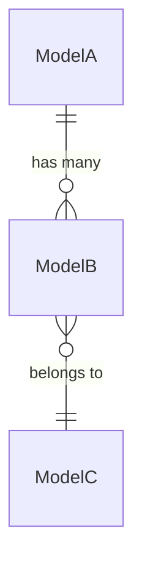

# Module: {TênModule}

> Ngày tạo: HH:mm:ss DD/MM/YYYY  
> Cập nhật lần cuối: HH:mm:ss DD/MM/YYYY

<!-- Hướng dẫn sử dụng template:
  - Copy file này vào docs/modules/{TênModule}/README.md
  - Điền thông tin vào từng section, xóa comment hướng dẫn
  - Xóa section nào không áp dụng (vd module không có Event thì xóa section 6)
  - Cập nhật "Cập nhật lần cuối" mỗi khi có thay đổi nội dung
-->

---

## 1. Mục đích nghiệp vụ

<!-- Trả lời: Module này giải quyết bài toán gì trong thực tế?
     Ai là người dùng chính? Được dùng ở màn hình/chức năng nào?
     Viết 2-4 câu, không liệt kê feature. -->

---

## 2. Vị trí trong codebase

```
app/Modules/{Module}/
  Controllers/
  Services/
  Models/
  Requests/
  Resources/
  Enums/
  Routes/
  [Events/]       ← nếu có
  [Listeners/]
  [Observers/]
  [Jobs/]
  [Notifications/]
  [Console/Commands/]
  [Exports/]
  [Imports/]
```

Route prefix: `/{module-kebab-case}`  
Namespace: `App\Modules\{Module}`

---

## 3. Entities & Models

| Model | Bảng | Mô tả | Multi-tenant |
|---|---|---|---|
| `{ModelName}` | `{table_name}` | Mô tả ngắn | ✓ HasOrganizationScope / ✗ |

### Quan hệ giữa entities



<!-- Hoặc mô tả dạng text nếu không dùng Mermaid:
  - ModelA hasMany ModelB (via foreign key xyz_id)
  - ModelB belongsTo ModelC
-->

### Trường quan trọng cần chú ý

| Model | Trường | Ý nghĩa / Lưu ý |
|---|---|---|
| `{ModelName}` | `status` | Xem `{Name}StatusEnum` — các giá trị và transition |
| `{ModelName}` | `organization_id` | Tenant key — không nhận từ client |

---

## 4. Business Rules & Invariants

<!-- Các ràng buộc nghiệp vụ KHÔNG được phép vi phạm, dù ở bất kỳ đâu trong code.
     Đây là phần quan trọng nhất — dev mới cần đọc kỹ trước khi sửa code. -->

- **Rule 1:** ...
- **Rule 2:** ...

---

## 5. State Machine (nếu có)

<!-- Chỉ điền nếu model chính có trường status với nhiều state và transition rules -->

| Trạng thái hiện tại | Sự kiện / Action | Trạng thái mới | Điều kiện |
|---|---|---|---|
| `draft` | `submit()` | `pending` | Phải có ít nhất 1 item |
| `pending` | `approve()` | `approved` | Người duyệt khác người tạo |

---

## 6. Luồng nghiệp vụ chính

### 6.1 {Tên luồng}

```
1. User gọi POST /api/{resource}
2. {Resource}Controller::store() → StoreRequest::validate()
3. {Resource}Service::store()
   ├─ DB::transaction()
   │   ├─ {Resource}::create($data)
   │   └─ sync relations nếu có
   └─ event(new {Resource}CreatedEvent($model))
4. Listener: GuiThongBao{Resource}Listener → dispatch job → queue: notifications
5. Response: 201 + {Resource}Resource
```

### 6.2 {Tên luồng khác}

<!-- Thêm luồng quan trọng khác (phê duyệt, đổi trạng thái, export...) -->

---

## 7. Events & Side-effects

<!-- Chỉ điền nếu module có fire event -->

| Event | Khi nào fire | Listeners | Queue |
|---|---|---|---|
| `{Resource}CreatedEvent` | Sau khi tạo mới thành công | `GuiThongBao{Resource}Listener` | notifications |
| `{Resource}StatusChangedEvent` | Sau khi đổi trạng thái | `LogStatusChange`, `GuiNhacNho` | default |

---

## 8. Permissions

| Permission key | Mô tả |
|---|---|
| `{resource}.index` | Xem danh sách |
| `{resource}.show` | Xem chi tiết |
| `{resource}.store` | Tạo mới |
| `{resource}.update` | Cập nhật |
| `{resource}.destroy` | Xóa |
| `{resource}.bulkDestroy` | Xóa hàng loạt |
| `{resource}.bulkUpdateStatus` | Đổi trạng thái hàng loạt |
| `{resource}.changeStatus` | Đổi trạng thái đơn |
| `{resource}.export` | Xuất Excel |
| `{resource}.import` | Nhập Excel |
| `{resource}.stats` | Xem thống kê |

---

## 9. API Endpoints

| Method | Path | Mô tả | Auth |
|---|---|---|---|
| `GET` | `/api/{resource}/stats` | Thống kê | ✓ |
| `GET` | `/api/{resource}` | Danh sách (filter/sort/paginate) | ✓ |
| `POST` | `/api/{resource}` | Tạo mới | ✓ |
| `GET` | `/api/{resource}/{id}` | Chi tiết | ✓ |
| `PUT` | `/api/{resource}/{id}` | Cập nhật | ✓ |
| `DELETE` | `/api/{resource}/{id}` | Xóa | ✓ |
| `DELETE` | `/api/{resource}/bulk-delete` | Xóa hàng loạt | ✓ |
| `PATCH` | `/api/{resource}/bulk-status` | Đổi trạng thái hàng loạt | ✓ |
| `PATCH` | `/api/{resource}/{id}/status` | Đổi trạng thái đơn | ✓ |
| `GET` | `/api/{resource}/export` | Xuất Excel | ✓ |
| `POST` | `/api/{resource}/import` | Nhập Excel | ✓ |
| `GET` | `/api/{resource}/public-options` | Dropdown công khai | ✗ |

---

## 10. Phụ thuộc module khác

<!-- Liệt kê module nào mà module này gọi vào, và ngược lại -->

| Phụ thuộc | Dùng gì | Ghi chú |
|---|---|---|
| `Core` | `MediaService`, `Organization`, `Department` | — |
| `Notification engine` | `NotificationDispatcher` | Fire event → engine lo gửi |

---

## 11. Điểm dễ gây lỗi khi maintain

<!-- Những điều không rõ ràng từ code, cần ghi chú để dev sau không mắc lại -->

- ...

---

## 12. Câu hỏi thường gặp

**Q:** Tại sao không dùng Observer ở đây?  
**A:** ...

**Q:** Tại sao {tình huống}?  
**A:** ...
